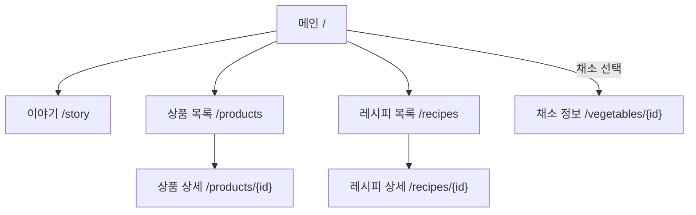
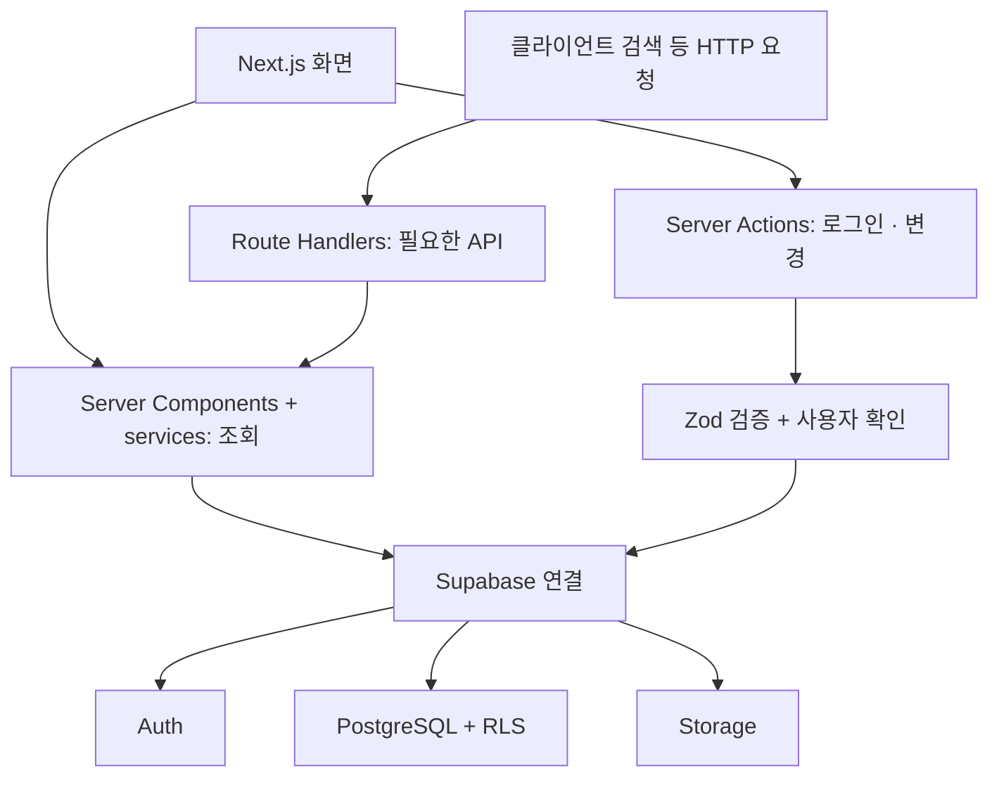

# 못난이마켓 — 3인 팀 프로젝트 개발 가이드

> 모양은 조금 달라도, 맛과 가치는 그대로.

모양·크기·흠집 때문에 일반 유통에서 판매하기 어려운 비규격 농산물을 합리적인 가격으로 소개하는 쇼핑 서비스입니다. 채소 정보와 요리 방법을 함께 제공해 구매에서 식탁까지 이어지는 경험을 만듭니다.

**문서 기준일: 2026-10-07 / 팀 구성: A·B·C, 총 3명 / 백엔드: FastAPI 없이 Next.js로 구성**

**현재 상태:** 이 README는 개발 계획과 협업 기준입니다. 문서 작성 시 저장소에는 애플리케이션 코드가 없었습니다. 아래 폴더·DB·함수·실행 명령은 구축할 구조이며, 기능 구현이나 배포 완료를 의미하지 않습니다. 초기 환경 구축 후 실제 설정과 진행 상태를 갱신합니다.

저장소 이름은 `group_6_vegetable_project`이며, 서비스 이름은 **못난이마켓**입니다. A·B·C의 실제 담당자 이름은 팀에서 확정합니다.

## 목차

1. [프로젝트 목표와 범위](#1-프로젝트-목표와-범위)
2. [기술 구성](#2-기술-구성)
3. [추천 개발 프로그램](#3-추천-개발-프로그램)
4. [페이지와 서비스 흐름](#4-페이지와-서비스-흐름)
5. [역할 분담](#5-역할-분담)
6. [백엔드 구성과 작업 경계](#6-백엔드-구성과-작업-경계)
7. [전체 폴더 구조](#7-전체-폴더-구조)
8. [데이터베이스 설계](#8-데이터베이스-설계)
9. [데이터와 함수 약속](#9-데이터와-함수-약속)
10. [로그인과 개인 데이터](#10-로그인과-개인-데이터)
11. [Storage와 이미지](#11-storage와-이미지)
12. [Zod와 보안 기준](#12-zod와-보안-기준)
13. [초기 환경 구축](#13-초기-환경-구축)
14. [팀원 로컬 실행](#14-팀원-로컬-실행)
15. [Git 협업 규칙](#15-git-협업-규칙)
16. [디자인과 반응형](#16-디자인과-반응형)
17. [개발 일정과 우선순위](#17-개발-일정과-우선순위)
18. [테스트와 완료 기준](#18-테스트와-완료-기준)
19. [Vercel 배포](#19-vercel-배포)
20. [문제 해결과 참고 자료](#20-문제-해결과-참고-자료)

## 1. 프로젝트 목표와 범위

### 목표

- 소비자: 정상 상품보다 합리적인 가격으로 농산물을 구매할 수 있는 흐름 제공.
- 농가: 버려질 뻔한 농산물의 새로운 판로를 소개.
- 환경: 음식물 폐기 감소와 가치소비 메시지 전달.
- 주 고객: 2030 1인 가구, 합리적인 소비와 가치소비에 관심 있는 사람.
- 학습: Next.js 라우팅, 공통 컴포넌트, 서버 처리, DB 연결, 인증, 협업·배포 경험.

### 이번에 구현할 범위

- 10개 페이지 유형과 Desktop/Mobile 대응.
- 상품 목록·필터·정렬·상세, 채소 정보와 상태 표시.
- 정적인 레시피 목록·상세와 상품 연결.
- 실제 로그인·로그아웃, 최소한의 마이페이지.
- 사용자별 장바구니·찜 저장. 두 기능은 `/cart` 안의 탭으로 통합.
- Supabase DB·Auth·Storage, Zod 검증, RLS 권한, Vercel 배포.

### 후순위 또는 제외

- 실제 결제, 주문 생성, 배송 추적, 주문 내역.
- 회원가입 전용 페이지, 비밀번호 찾기, 소셜 로그인.
- 관리자 페이지, 판매자 관리, 재고 예약.
- AI 레시피 추천, 외부 AI API 연결.
- 사용자 냉장고의 보유 채소·신선도 관리.

로그인은 먼저 준비한 테스트 계정으로 검증합니다. 신규 사용자를 받는 회원가입 흐름은 기본 기능이 완성된 뒤 범위를 합의합니다. 제외 기능의 버튼은 배치하지 않거나, 시연용임을 명확히 안내합니다.

## 2. 기술 구성

| 구분 | 사용 기술 | 프로젝트에서의 역할 |
|---|---|---|
| Frontend | Next.js / TypeScript / Tailwind CSS | App Router 페이지, 컴포넌트, 반응형 UI |
| Backend | Next.js Server Actions & Route Handlers | 입력 검증, 인증 확인, 데이터 조회·변경 |
| Database | Supabase PostgreSQL | 상품·채소·레시피·개인 데이터 저장 |
| Authentication | Supabase Auth | 계정과 로그인 세션 관리 |
| Storage | Supabase Storage | 상품·채소·요리 이미지 저장 |
| Validation | Zod | 폼·필터·서버 입력값 검증 |
| Security | Supabase Row Level Security | 사용자별 데이터 접근 제한 |
| Deployment | Vercel | Next.js 배포, Preview 확인 |
| Development | VS Code / Git / GitHub | 편집, 버전 관리, 코드 리뷰 |

**FastAPI는 사용하지 않습니다.** 프론트와 백엔드 모두 하나의 Next.js 프로젝트 안에서 TypeScript로 작성합니다. Python 서버, 별도 백엔드 저장소, FastAPI용 실행·배포 환경은 만들지 않습니다. Next.js의 서버 코드가 Supabase SDK를 통해 Auth·PostgreSQL·Storage에 연결합니다.

```text
사용자 브라우저
    → Next.js 페이지·컴포넌트
    → Next.js Server Actions / Route Handlers
    → Supabase Auth / PostgreSQL / Storage
```

개발 서버는 `npm run dev` 하나로 실행합니다. 화면과 서버 코드는 Vercel에 함께 배포하고, DB·인증·이미지 저장은 Supabase에서 운영합니다. 프론트와 별도 API 서버를 연결하기 위한 포트 설정·CORS 구성은 기본 구조에 필요하지 않습니다.

### 권장 버전 운영

- Node.js는 **24.x LTS**를 기준으로 팀원과 Vercel의 주 버전을 통일합니다. [Node.js 공식 다운로드](https://nodejs.org/en/download)
- 신규 앱은 **Next.js 16 계열 + App Router**를 기준으로 시작합니다. 기존 앱이 생긴 뒤에는 합의 없이 주 버전을 변경하지 않습니다.
- 정확한 패키지 버전은 초기 설치 후 `package.json`과 `package-lock.json`으로 공유합니다.
- 패키지 관리자는 **npm 하나로 통일**합니다. npm·pnpm·yarn 잠금 파일을 함께 관리하지 않습니다.
- Tailwind는 프로젝트 생성 시 설치된 버전을 사용합니다. v3 설정 예제와 v4 설정을 혼합하지 않습니다. [Tailwind Next.js 안내](https://tailwindcss.com/docs/installation/framework-guides/nextjs)

## 3. 추천 개발 프로그램

### 필수

| 프로그램·서비스 | 사용 목적 | 권장 설정·담당 |
|---|---|---|
| [VS Code](https://code.visualstudio.com/) | 코드 편집, 터미널, 변경 확인 | 전원 사용, 저장 시 서식 정리 |
| [Node.js](https://nodejs.org/en/download) | Next.js 실행과 npm | 24.x LTS 주 버전 통일 |
| [Git](https://git-scm.com/downloads) | 브랜치·커밋·동기화 | 전원 설치 |
| [GitHub](https://github.com/KANT-2/group_6_vegetable_project) | 저장소·PR·이슈 | 전원 저장소 접근 권한 확인 |
| Chrome 또는 Edge | 브라우저 검수 | 개발자 도구로 모바일·통신·오류 확인 |
| [Supabase Dashboard](https://supabase.com/dashboard) | Auth·DB·Storage 확인 | C가 초기 설정, 각자 자기 데이터 확인 |
| [Vercel Dashboard](https://vercel.com/dashboard) | 배포와 로그 확인 | B가 초기 연결, C가 인증 설정, 전원 Preview 검수 |

VS Code에는 TypeScript 지원이 포함되어 있어 별도 TypeScript 편집기를 설치할 필요가 없습니다. [VS Code TypeScript 안내](https://code.visualstudio.com/docs/languages/typescript)

### VS Code 권장 확장

| 확장 | 확장 ID | 사용 목적 |
|---|---|---|
| [ESLint](https://marketplace.visualstudio.com/items?itemName=dbaeumer.vscode-eslint) | `dbaeumer.vscode-eslint` | 코드 규칙과 오류 확인 |
| [Prettier](https://marketplace.visualstudio.com/items?itemName=esbenp.prettier-vscode) | `esbenp.prettier-vscode` | 서식 통일 |
| [Tailwind CSS IntelliSense](https://marketplace.visualstudio.com/items?itemName=bradlc.vscode-tailwindcss) | `bradlc.vscode-tailwindcss` | Tailwind 클래스 작성 지원 |

서식 규칙은 개인 설정에만 두지 않고 `.prettierrc.json`과 `.vscode/settings.json`으로 공유합니다. Prettier는 서식, ESLint는 코드 규칙을 담당하도록 충돌을 정리합니다.

### 선택

- [GitHub Desktop](https://desktop.github.com/): Git 명령에 익숙하지 않은 팀원이 브랜치·커밋·변경 내용을 확인할 때 사용.
- Supabase CLI: migration 적용·DB 타입 생성 담당자가 사용. 전원이 로컬 DB를 운영할 필요는 없습니다.
- Docker: **로컬 Supabase 전체 환경을 실행할 때만** 준비. 원격 개발용 Supabase 프로젝트를 사용하는 기본 흐름에서는 필수 프로그램으로 두지 않습니다. [Supabase CLI 안내](https://supabase.com/docs/guides/local-development/cli/getting-started)
- Playwright: 주요 서비스 흐름 자동 검증을 추가할 때 사용. 짧은 일정에서는 수동 검수표부터 완성합니다.

처음에는 필수 도구와 위 확장 3개로 시작하고, 별도 DB GUI나 API 도구는 실제 필요가 생기면 추가합니다.

## 4. 페이지와 서비스 흐름

| 담당 | URL | 페이지 | 핵심 요소 | 접근 |
|---|---|---|---|---|
| A | `/` | 메인 | 히어로, 이야기·상품·레시피·채소 정보 진입, 추천 상품 4개 | 공개 |
| A | `/story` | 이야기 | 농가 이야기, 비규격 농산물, 가치소비 | 공개 |
| A | `/recipes` | 레시피 목록 | 요리 카드, 간단한 소개 | 공개 |
| A | `/recipes/[id]` | 레시피 상세 | 재료, 순서, 관련 판매 상품 | 공개 |
| B | `/products` | 상품 목록 | 카테고리, 상태·가격 필터, 정렬 | 공개 |
| B | `/products/[id]` | 상품 상세 | 가격, 수량, 상태, 농가, 요리, 담기·찜 | 공개 |
| B | `/vegetables/[id]` | 채소 정보 | 특징, 보관·손질법, 관련 상품·요리 | 공개 |
| C | `/cart` | 장바구니·찜 | 탭, 수량, 삭제, 금액, 빈 상태 | 로그인 필요 |
| C | `/login` | 로그인 | 이메일·비밀번호, 성공·실패 안내 | 공개 |
| C | `/mypage` | 마이페이지 | 닉네임, 간단한 설정, 로그아웃 | 로그인 필요 |

페이지 수는 **화면 유형 10개** 기준입니다. 감자 상세와 당근 상세는 같은 동적 페이지 유형으로 계산합니다. 찜은 별도 `/wishlist` 페이지를 만들지 않습니다.

### 공개 페이지의 기본 이동 흐름

메인에서 **이야기 / 상품 목록 / 레시피 목록 / 채소 정보**로 각각 진입합니다. 아래 박스는 화면 이동 흐름이며 DB 테이블 관계를 나타내는 ERD는 아닙니다.



박스의 `{id}`는 실제 Next.js 폴더 `[id]`의 동적 ID를 뜻합니다. 채소 정보는 메인의 채소 선택 링크에서 바로 상세로 연결합니다. 별도 `/vegetables` 목록 페이지는 추가하지 않아 기존 10페이지 구성을 유지합니다.

### 상세 페이지 간 연결

| 현재 화면 | 이동할 화면 | 화면 안의 링크 |
|---|---|---|
| 이야기 | 상품 목록 | 채소 만나보기 |
| 상품 상세 | 채소 정보 | 이 채소 알아보기 |
| 상품 상세 | 레시피 상세 | 관련 요리 카드 |
| 채소 정보 | 상품 상세·레시피 상세 | 관련 상품·요리 카드 |
| 레시피 상세 | 상품 상세 | 구매 가능한 재료 상품 |

상세 간 연결을 기본 흐름 박스의 교차 화살표로 겹쳐 그리지 않고 위 표로 구분합니다. 공개 정보는 로그인 없이 둘러볼 수 있습니다.

### 로그인과 개인 화면

장바구니·찜 `/cart`와 마이페이지 `/mypage`는 헤더의 개인 메뉴에서 접근합니다. 로그인한 사용자는 바로 이용하고, 비로그인 사용자는 `/login?next=...`로 안내한 뒤 원래 요청한 화면으로 돌아옵니다. 로그인 화면을 반드시 거쳐야 모든 페이지를 볼 수 있는 구조로 표시하지 않습니다.

상품 상세의 담기·찜 버튼도 같은 인증 규칙을 사용합니다. 초기 범위에서는 비로그인 상태의 클릭을 로그인 후 자동 실행하지 않고, 원래 상품 화면에서 다시 누르도록 안내합니다.

## 5. 역할 분담

### 전체 배분

| 담당 | 페이지 수 | 프론트 범위, 모바일 포함 | 직접 소유하는 백엔드 |
|---|---:|---|---|
| A | 4 | 메인·이야기·레시피 목록·상세, 디자인 규칙 | 레시피 조회·연결·데이터·읽기 권한 |
| B | 3 | 상품·채소 정보 | 상품·채소 조회·필터·데이터·읽기 권한 |
| C | 3 | 로그인·마이페이지·장바구니·찜 통합, 공통 메뉴 | 인증·프로필·장바구니·찜·개인 접근 권한 |

**A 4 / B 3 / C 3페이지**로 배분하고, 같은 기능의 목록·상세·데이터는 한 사람이 끝까지 맡습니다. A가 레시피 목록·상세·조회·DB를 모두 담당합니다. A의 공통 작업 부담은 레시피를 나누는 대신 C가 전체 레이아웃·Header·Footer·모바일 메뉴를 맡아 줄입니다. 로그인 상태·장바구니 수 표시도 C 안에서 함께 연결합니다. 색상·글자·여백 규칙은 A가 정하고 전원이 사용합니다.

Supabase가 인증 서비스를 제공해도 세션·개인 권한·저장 실패·중복 요청 처리는 C의 개발 작업입니다. C가 빈 역할이라는 뜻은 아니며, 페이지 수만으로 공정성을 판단하지 않습니다. 이 배분은 팀원의 숙련도가 아직 정해지지 않은 상태의 시작안이고 실제 소요 시간을 보고 조정합니다.

### 작업량 산정 기준

각 기능에 **Desktop UI + Mobile UI·터치 + 데이터 연결 + 로딩·빈 상태·오류 + 검수** 시간을 모두 포함합니다. 아래 평가는 실제 시간 측정이 아닌 계획용 상대 비교입니다.

| 담당 | 화면 작업의 특성 | 숨겨진 공통·서버 작업 | 부담을 제한하는 방법 |
|---|---|---|---|
| A | 메인·이야기·레시피 목록·상세 | 디자인 규칙·레시피 데이터 | 공통 레이아웃·메뉴는 C, 문서·발표는 각자 작성 |
| B | 상품 필터·상세·채소 정보를 연결 | catalog 조회·상태·이미지 | 담기·찜 저장은 C 컴포넌트 사용 |
| C | 개인 화면 3개와 공통 메뉴 | 인증·RLS·장바구니 저장·공통 기반 | 레시피 전체는 A, 회원가입·주문 관리 제외, 배포 실행은 B |

모바일은 후순위로 몰아서 하는 작업이 아니라 각 페이지의 완료 조건입니다. 화면이 하나 끝날 때 모바일에서 같은 기능도 함께 확인합니다.

### A — 콘텐츠·디자인·레시피

**프론트:** 메인, 이야기, 레시피 목록·상세, 색상·글자·여백 규칙. 메인의 이야기·상품·레시피·채소 정보 진입 영역을 구성하고 B의 채소 ID·조회 데이터로 선택 링크를 연결. 메인 세로 배치·레시피 목록 그리드·상세의 재료와 조리 순서도 A가 모바일까지 구현.

**백엔드:** `getRecipes`, `getRecipe`, `getRecipesByProduct`, `getRecipesByVegetable`; 레시피 테이블과 상품 연결 테이블, 공개 읽기 정책, 예시 데이터.

**기타:** 브랜드·요리 이미지 업로드와 출처 정리. README와 발표는 각자 자기 부분을 작성하고 검토하며 A에게 전체 작성·취합을 몰지 않습니다.

**완료 기준:** 메인 네 갈래 진입, 레시피 목록 → 상세 → 관련 상품 이동, 실제 이미지와 읽기 좋은 모바일 배치. 긴 재료·조리 순서가 줄바꿈되고 없는 레시피 ID는 404 처리.

### B — 상품·채소

**프론트:** 상품 목록·상세, 채소 정보 상세, ProductCard·필터·수량 선택. 모바일 2열 목록·필터 패널·세로 상세·하단 담기 영역까지 B가 구현. 하단 영역 안의 저장 버튼은 C의 공통 버튼을 사용.

**백엔드:** `getProducts`, `getProduct`, `getVegetable`, `getProductsByVegetable`; 상품·채소 테이블, 가격·카테고리·상태 검증, 예시 데이터와 공개 읽기 정책.

**기타:** 상품·채소 이미지 업로드, 이미지 원본 출처, 가격 표시 함수, 초기 데이터와 화면 데이터 매핑. Vercel 연결·배포 실행을 B가 맡고 인증·환경변수 검수는 C와 함께 진행.

**완료 기준:** Desktop/Mobile에서 필터·정렬·빈 결과가 정상, 상품에서 채소 정보로 이동 가능, 판매 상품 상태가 일반 채소 정보와 구분됨. 필터 패널·하단 버튼이 스크롤과 터치에서 콘텐츠를 가리지 않음.

**경계:** 담기·찜 버튼은 C의 컴포넌트를 사용합니다. 인증·장바구니 저장을 B가 다시 만들지 않습니다.

### C — 인증·개인 데이터·공통 기반

**프론트:** 로그인, 마이페이지, 장바구니·찜 통합 화면, 전체 레이아웃·Header·Footer·모바일 메뉴·공통 UI, 담기·찜 공통 버튼, 헤더의 로그인 상태·개인 상품 수 갱신. A가 정한 디자인 규칙으로 공통 컴포넌트를 구현하고 모바일 메뉴·장바구니 카드·입력 키보드·저장 결과 안내를 함께 처리.

**백엔드:** 로그인·로그아웃·사용자 확인, 프로필 조회·수정, 장바구니·찜 조회·추가·수정·삭제, Zod 검증과 사용자별 RLS.

**기타:** Supabase 연결·세션·환경변수, 초기 패키지 설정, Storage 공통 정책, DB 적용 순서·타입 생성, 배포 인증 검수. Vercel 연결과 배포 실행은 B가 지원.

**완료 기준:** 새로고침해도 세션·장바구니 유지, 사용자 간 데이터 분리, 서버 실패 시 오류 안내, 로그아웃 후 개인 화면에 이전 사용자 데이터가 남지 않음. 모바일 메뉴 열기·닫기·링크 이동이 가능하며 로그인 상태와 장바구니 수가 헤더에 반영됨.

### 함께 지킬 경계

- `layout.tsx`·Header·Footer·모바일 메뉴·Provider 연결은 C. A는 디자인 규칙을 제공하고 공통 컴포넌트의 최종 코드 담당은 C로 통일.
- `package.json`, lockfile, Supabase 연결 파일은 C. 패키지 추가 요청은 C와 먼저 합의.
- 각자 자기 SQL에 권한 정책까지 작성. C가 전체 인증·권한 연동을 검토.
- 데이터 필드·함수 반환 형식 변경은 사용하는 사람에게 알리고 문서와 함께 수정.
- 레시피 목록·상세·컴포넌트·조회 함수·DB는 모두 A. 상품과 연결하는 ID·조회 결과 형식만 B와 합의.
- A의 `RecipeCard`, B의 `ProductCard`는 담당자가 모바일까지 구현. 다른 페이지 담당자는 공통 카드를 재사용하고 각자 주변 레이아웃을 조정.
- 각자 자기 README 항목·캡처·발표 설명을 작성. 공통 문구 변경은 PR에서 함께 검토.
- 담당자: A 조영우, B 심우섭, C 이상재. 공통 작업은 세 사람이 함께 담당.

| 역할 | 이름 | 작업 브랜치 예시 |
|---|---|---|
| A | 조영우 | `feat/brand`, `feat/recipes` |
| B | 심우섭 | `feat/products`, `feat/vegetables` |
| C | 이상재 | `feat/auth`, `feat/shopping`, `feat/layout` |

### Redmine 작업 현황 관리

[6팀 Redmine 일감 목록](https://redmine-302549221655.asia-northeast3.run.app/projects/ax2-react-team6/issues)에서 진행 현황을 관리합니다. 2026-10-07에 14개 일감(#2~#15)을 등록하고 실제 담당자를 지정했습니다. 등록 상태는 신규·0%이며, 구현 완료를 의미하지 않습니다. 시작일·마감일·추정시간은 팀이 합의한 뒤 입력합니다.

| 역할 | 실제 담당자 | 등록된 일감 |
|---|---|---|
| A | 조영우 | [#3 메인·이야기](https://redmine-302549221655.asia-northeast3.run.app/issues/3), [#4 레시피 전체](https://redmine-302549221655.asia-northeast3.run.app/issues/4), [#5 디자인 규칙](https://redmine-302549221655.asia-northeast3.run.app/issues/5) |
| B | 심우섭 | [#6 상품 목록·필터](https://redmine-302549221655.asia-northeast3.run.app/issues/6), [#7 상품·채소 상세](https://redmine-302549221655.asia-northeast3.run.app/issues/7), [#8 상품·채소 DB](https://redmine-302549221655.asia-northeast3.run.app/issues/8), [#9 배포](https://redmine-302549221655.asia-northeast3.run.app/issues/9) |
| C | 이상재 | [#10 공통 기반](https://redmine-302549221655.asia-northeast3.run.app/issues/10), [#11 공통 레이아웃·메뉴](https://redmine-302549221655.asia-northeast3.run.app/issues/11), [#12 인증](https://redmine-302549221655.asia-northeast3.run.app/issues/12), [#13 마이페이지](https://redmine-302549221655.asia-northeast3.run.app/issues/13), [#14 장바구니·찜](https://redmine-302549221655.asia-northeast3.run.app/issues/14) |
| 공통 | 조영우·심우섭·이상재 | [#2 계획·역할·흐름 검토](https://redmine-302549221655.asia-northeast3.run.app/issues/2), [#15 통합·모바일 검수·시연](https://redmine-302549221655.asia-northeast3.run.app/issues/15) |

Redmine의 담당자 필드는 한 명만 선택할 수 있으므로 공통 일감의 대표 담당자는 조영우로 지정하고, 설명에는 조영우·심우섭·이상재를 공동 담당자로 기록합니다. 세 사람 모두 일감관람자로 등록했습니다. 대표 지정은 공동 작업을 조영우 혼자 수행한다는 의미가 아닙니다. Redmine 계정 표시는 각각 ‘영우 조’, ‘우섭 심’, ‘상재 이’입니다.

작업을 시작하거나 마무리할 때 해당 일감 → 편집 → 담당자·상태·진척도 확인 → 댓글에 오늘 한 일·막힌 점·다음 작업·PR/캡처 링크 → 확인 순서로 갱신합니다. 현재 상태 선택지는 신규·진행·해결·의견·완료·거절입니다. 실제 완료 조건과 모바일 검수 결과를 확인한 뒤 완료 처리합니다.

[팀 노션](https://app.notion.com/p/teamsparta/6-3f22dc3ef514808ea570f2df24d9af94)의 개인 일지에는 역할·문제·접근·결과를 기록하고 해당 Redmine 일감 링크를 붙입니다. Redmine은 작업 상태, 노션은 수행 과정, GitHub PR은 코드 변경의 근거로 사용합니다.

## 6. 백엔드 구성과 작업 경계

### FastAPI 없이 서버 기능을 만드는 방법

| 필요한 기능 | Next.js에서 구현할 위치 | 예시 |
|---|---|---|
| 페이지를 열 때 데이터 읽기 | Server Component → `services/` | 상품 목록·상세·레시피 조회 |
| 폼 제출·버튼으로 데이터 변경 | `actions/`의 Server Actions | 로그인, 프로필 수정, 장바구니 담기 |
| HTTP API가 실제로 필요한 요청 | `app/api/**/route.ts`의 Route Handlers | 클라이언트 공개 검색 |
| 로그인 세션 갱신 | `proxy.ts`와 Supabase SSR 코드 | 새로고침 시 세션 유지 |
| 영구 데이터·파일 저장 | Supabase SDK | PostgreSQL·Storage 접근 |

`backend/`, `main.py`, `requirements.txt`, Python 가상환경, `uvicorn` 실행은 이 프로젝트 구조에 포함하지 않습니다. A·B·C 모두 아래 Next.js 폴더 안에서 자기 도메인의 서버 코드를 작성합니다. Server Actions를 쓰더라도 입력 검증과 사용자별 권한 확인은 각 서버 함수 안에 구현합니다.



| 처리 | 방식 | 담당 |
|---|---|---|
| 페이지 초기 상품·채소·레시피 조회 | Server Component에서 `services` 직접 호출 | 공개 콘텐츠 화면·조회 함수는 A·B, 개인 화면은 C |
| 로그인, 닉네임, 장바구니·찜 변경 | Server Actions | C |
| 클라이언트가 HTTP로 요청하는 공개 검색 등 | 필요할 때 Route Handlers | A·B |
| 외부 Auth callback | 소셜·이메일 링크 인증을 추가할 때 Route Handler | C, 후순위 |

**동일한 기능을 Server Action과 API 양쪽에 중복 구현하지 않습니다.** 서버 페이지가 자기 `/api/products`를 다시 호출하는 대신 조회 함수를 사용합니다. Route Handler가 필요하면 같은 조회 함수·검증 규칙을 재사용합니다. [Next.js 백엔드 구성](https://nextjs.org/docs/app/guides/backend-for-frontend)

조회 함수는 `import 'server-only'`로 서버 전용 경계를 표시합니다. 클라이언트 컴포넌트에서 서버 조회 모듈을 직접 가져오지 않고 서버 페이지가 데이터를 Props로 전달합니다.

## 7. 전체 폴더 구조

아래는 **구축 예정 구조**입니다. 선택 API·테스트 파일은 필요해질 때 생성하며, 현재 존재하는 파일 목록이 아닙니다.

```text
group_6_vegetable_project/
├─ src/
│  ├─ app/
│  │  ├─ layout.tsx                       # C: 전체 레이아웃·Provider·공통 메뉴
│  │  ├─ globals.css                      # A: Tailwind·디자인 규칙
│  │  ├─ page.tsx                         # A: 메인
│  │  ├─ loading.tsx                      # A: 공통 로딩
│  │  ├─ error.tsx                        # A: 공통 오류 UI
│  │  ├─ not-found.tsx                    # A: 공통 404
│  │  ├─ story/page.tsx                   # A: 이야기
│  │  ├─ recipes/
│  │  │  ├─ page.tsx                      # A: 레시피 목록
│  │  │  └─ [id]/page.tsx                 # A: 레시피 상세·조회 연결
│  │  ├─ products/
│  │  │  ├─ page.tsx                      # B: 상품 목록
│  │  │  └─ [id]/page.tsx                 # B: 상품 상세
│  │  ├─ vegetables/[id]/page.tsx         # B: 채소 정보
│  │  ├─ cart/page.tsx                    # C: 장바구니·찜
│  │  ├─ login/page.tsx                   # C: 로그인
│  │  ├─ mypage/page.tsx                  # C: 마이페이지
│  │  └─ api/                            # 필요한 HTTP API만 추가
│  │     ├─ products/route.ts             # B: 선택, 공개 상품 검색
│  │     └─ recipes/route.ts              # A: 선택, 공개 레시피 검색
│  │
│  ├─ components/
│  │  ├─ common/                         # C: Header·Footer·Button·EmptyState, A 디자인 규칙
│  │  ├─ recipes/                        # A: RecipeCard·RecipeSteps
│  │  ├─ products/                       # B: ProductCard·Filters·QuantitySelector
│  │  ├─ vegetables/                     # B: VegetableInfo·StorageGuide
│  │  ├─ shopping/                       # C: AddToCartButton·WishlistButton·CartItem
│  │  └─ account/                        # C: LoginForm·ProfileForm
│  │
│  ├─ services/                          # 서버 전용 조회
│  │  ├─ recipes.ts                      # A
│  │  ├─ products.ts                     # B
│  │  ├─ vegetables.ts                   # B
│  │  ├─ profile.ts                      # C
│  │  ├─ cart.ts                         # C
│  │  └─ wishlist.ts                     # C
│  ├─ actions/                           # 서버 변경 처리
│  │  ├─ auth.ts                         # C
│  │  ├─ profile.ts                      # C
│  │  ├─ cart.ts                         # C
│  │  └─ wishlist.ts                     # C
│  ├─ schemas/                           # Zod 입력 검증
│  │  ├─ recipe.ts                       # A
│  │  ├─ product.ts                      # B
│  │  ├─ vegetable.ts                    # B
│  │  ├─ auth.ts                         # C
│  │  ├─ profile.ts                      # C
│  │  └─ shopping.ts                     # C
│  ├─ lib/
│  │  ├─ supabase/
│  │  │  ├─ client.ts                    # C: 브라우저 연결
│  │  │  ├─ server.ts                    # C: 요청별 서버 연결
│  │  │  └─ session.ts                   # C: 세션 갱신
│  │  ├─ auth.ts                        # C: 사용자 검증
│  │  ├─ storage.ts                     # C: 이미지 URL 공통 처리
│  │  └─ format.ts                      # B: 금액·할인율 표시
│  ├─ context/ShoppingContext.tsx         # C: 화면 상태, DB가 저장 기준
│  ├─ types/
│  │  ├─ recipe.ts                       # A
│  │  ├─ product.ts                      # B
│  │  ├─ vegetable.ts                    # B
│  │  ├─ profile.ts                      # C
│  │  ├─ shopping.ts                     # C
│  │  ├─ result.ts                       # C: 공통 변경 결과
│  │  └─ database.ts                     # C: DB 타입 자동 생성
│  ├─ data/mock/
│  │  ├─ recipes.ts                      # A: DB 전 화면 작업용
│  │  ├─ products.ts                     # B
│  │  └─ vegetables.ts                   # B
│  └─ proxy.ts                           # C: Next.js 16 세션 갱신
│
├─ public/images/placeholder.svg          # A: 이미지 실패·와이어프레임용
├─ supabase/
│  ├─ config.toml                        # C: CLI·seed 경로
│  ├─ migrations/
│  │  ├─ <timestamp>_catalog.sql          # B: 채소·상품·읽기 권한
│  │  ├─ <timestamp>_recipes.sql          # A: 레시피·연결·읽기 권한
│  │  ├─ <timestamp>_profiles.sql         # C: 프로필·본인 권한
│  │  ├─ <timestamp>_shopping.sql         # C: 장바구니·찜·본인 권한
│  │  └─ <timestamp>_storage.sql          # C: bucket·Storage 정책
│  └─ seeds/
│     ├─ catalog.sql                     # B
│     └─ recipes.sql                     # A
├─ docs/
│  ├─ page-plan.md                       # 전원: 각자 담당 부분 작성
│  ├─ data-contract.md                   # 전원: 각자 담당 함수 작성
│  ├─ image-sources.md                   # 전원: 각자 출처 작성
│  ├─ test-checklist.md                   # 전원 검수
│  ├─ mobile-checklist.md                # 전원: 페이지별 휴대폰 검수
│  ├─ wireframes/                        # 전원: 각자 화면 제공
│  └─ screenshots/                       # 각자 실행 화면
├─ tests/                                # 핵심 기능 검증, 구현 후 추가
├─ .vscode/                              # A 서식·C 실행 설정 조율
├─ .env.example                          # C: 실제 값 없는 설정 예시
├─ .env.local                            # 개인 설정, Git 제외
├─ .gitignore
├─ .nvmrc                                # C: Node 주 버전 24
├─ package.json                          # C
├─ package-lock.json                     # C, 의존성 변경 시 함께 커밋
├─ next.config.ts                        # B: 이미지·배포 설정, C 인증 검수
├─ postcss.config.mjs                     # 초기 생성 설정 유지
├─ eslint.config.mjs
├─ .prettierrc.json
├─ tsconfig.json
└─ README.md                             # 전원: 각자 담당 부분 수정
```

Next.js 15 이하를 사용하게 된다면 `proxy.ts` 대신 `middleware.ts`가 필요합니다. 16 기준 문서와 다른 버전의 인증 예제를 섞지 않습니다. [Supabase SSR 설정](https://supabase.com/docs/guides/auth/server-side/creating-a-client?framework=nextjs)

## 8. 데이터베이스 설계

### 기본 테이블

| 테이블 | 주요 필드 | 담당 |
|---|---|---|
| `vegetables` | `id`, `name`, `category`, `description`, `storage_guide`, `prep_guide`, `image_path` | B |
| `products` | `id`, `vegetable_id`, `name`, `price`, `original_price`, `unit`, `ugly_reason`, `condition_note`, `farm_name`, `farm_region`, `farm_story`, `image_path`, `is_seasonal`, `is_active` | B |
| `recipes` | `id`, `name`, `description`, `ingredients` JSONB, `steps` JSONB, `image_path` | A |
| `recipe_products` | `recipe_id`, `product_id` | A |
| `profiles` | `id` = Auth 사용자 UUID, `nickname`, `updated_at` | C |
| `cart_items` | `id`, `user_id`, `product_id`, `quantity`, `created_at`, `updated_at` | C |
| `wishlist_items` | `id`, `user_id`, `product_id`, `created_at` | C |

제품·채소·레시피의 `id`는 초기 범위에서 안정적인 문자열을 사용합니다. 예: `potato`, `potato-small-2kg`, `potato-pancake`. 사용자 ID는 Auth의 UUID를 사용하며, 이름이나 배열 순서로 상품을 연결하지 않습니다.

### 채소 정보와 상품 상태의 구분

- `vegetables`: 감자라는 채소 자체의 특징·보관·손질 정보.
- `products`: 특정 농가가 판매하는 감자 2kg의 가격·크기·흠집·모양 정보.
- `ugly_reason`: 필터 가능한 분류. 예: 작은 크기 / 휜 모양 / 표면 흠집.
- `condition_note`: 소비자에게 보여줄 구체적인 설명. 먹기 어려운 부패 상품을 뜻하는 표현으로 사용하지 않음.
- 냉장고 보유 채소의 신선도 관리는 별도 기능으로, 현재 테이블에 혼합하지 않음.

### 제약 조건과 처리 기준

- 가격은 원 단위 정수. `price > 0`, `original_price >= price`.
- 할인율은 가격에서 계산해 표시. 중복 저장해 가격과 어긋나지 않게 함.
- 장바구니는 `UNIQUE(user_id, product_id)`, 수량은 정수 1~99.
- 찜은 `UNIQUE(user_id, product_id)`로 중복 방지.
- 레시피 연결은 `PRIMARY KEY(recipe_id, product_id)`로 중복 방지.
- 외래 키와 사용자 ID 조회용 인덱스 추가. 판매 종료 상품은 기본적으로 `is_active=false`로 처리.
- 레시피 재료에는 비판매 재료도 기록 가능. `recipe_products`는 구매 가능한 관련 상품만 연결.
- API에서 `null` 상세와 DB 장애를 구분. 없는 ID는 404, DB 장애는 오류 화면.
- 같은 상품을 동시에 담는 경우에도 수량 갱신이 유실되지 않도록 원자적인 DB 변경으로 처리. RPC를 쓰면 로그인 사용자 검증과 기본 권한을 유지.

### Migration·seed 규칙

1. B의 catalog → A의 recipes → C의 profiles·shopping·storage 순서로 의존성을 정리.
2. 실제 migration은 Supabase CLI가 생성한 timestamp 파일명을 사용하고, 생성 후 순서를 확인.
3. 이미 공유 DB에 적용한 migration은 수정하지 않고 새 migration 추가.
4. 각자의 seed를 분리하고 catalog → recipes 순서로 적용. `config.toml`의 seed 경로를 실제 파일과 맞춤.
5. 반복 입력해도 중복이 생기지 않도록 seed ID와 upsert 기준을 고정.
6. seed에는 실제 개인정보·비밀번호를 넣지 않음. 테스트 계정은 Supabase Auth에서 따로 준비.
7. 공유 DB에 migration을 적용하는 사람은 C 한 명으로 통일. A·B는 SQL PR을 제공.
8. 공유 원격 DB에서 reset하지 않음. 초기화 검증은 별도 로컬·개발 환경에서 수행.

처음에는 채소 6종 이상, 판매 상품 6개 이상, 레시피 4개 이상으로 전체 흐름을 완성한 뒤 데이터를 늘립니다. migration 작성·적용 방법은 [Supabase 공식 문서](https://supabase.com/docs/guides/local-development/database-migrations)를 따릅니다.

## 9. 데이터와 함수 약속

DB 필드는 `snake_case`, 화면용 TypeScript 필드는 `camelCase`로 정하고 `services`에서 변환합니다. 가격·이미지·연결 ID 변환을 각 페이지에 중복 작성하지 않습니다.

| 담당 | 함수 | 결과·용도 |
|---|---|---|
| B | `getProducts(filters)` | `{ items, total }`, 카테고리·가격·이유·정렬·페이지 검증 |
| B | `getProduct(id)` | `ProductDetail` 또는 `null` |
| B | `getVegetable(id)` | `Vegetable` 또는 `null` |
| B | `getProductsByVegetable(id)` | 해당 채소의 판매 상품 |
| A | `getRecipes(filters?)` | 레시피 목록 |
| A | `getRecipe(id)` | `RecipeDetail` 또는 `null`, 관련 판매 상품 포함 |
| A | `getRecipesByProduct(id)` | 상품과 연결된 요리 |
| A | `getRecipesByVegetable(id)` | 해당 채소의 상품을 통해 연결된 요리, 중복 제거 |
| C | `getCurrentUser()`, `requireUser()` | 서버 검증 사용자 확인 |
| C | `signIn(input)`, `signOut()` | 인증 변경 |
| C | `getProfile()`, `updateProfile(input)` | 현재 사용자 프로필 |
| C | `getCart()`, `addToCart(input)` | 장바구니 조회·추가 |
| C | `updateCartQuantity(input)`, `removeFromCart(input)` | 수량·삭제 |
| C | `getWishlist()`, `toggleWishlist(input)` | 찜 조회·변경 |
| C | `moveWishlistToCart(input)` | 담기 성공 후 찜에서 제거하는 이동 |

개인 함수는 화면에서 `userId`를 받지 않고 서버에서 로그인 사용자를 결정합니다. 읽기 실패는 빈 목록으로 숨기지 않습니다. 변경 함수는 성공 여부·필드별 오류·안내 문구를 공통 `ActionResult<T>`로 반환하도록 합의합니다. 오류 문구에 DB 내부 정보·키·세션을 노출하지 않습니다.

`ProductCard`는 상품 객체를 Props로 받고, 카드 내부에서 DB를 조회하지 않습니다. 상품 상세에서 C의 `AddToCartButton`과 `WishlistButton`을 사용합니다. 필요한 입력은 상품 ID와 수량이며 가격은 서버의 상품 값을 기준으로 합니다.

## 10. 로그인과 개인 데이터

### 초기 로그인 흐름

1. C가 테스트 계정을 Supabase Auth에 준비.
2. 이메일·비밀번호 입력 → Zod 검증 → Supabase Auth 로그인.
3. 성공하면 허용된 앱 내부 `next` 경로로 이동. 외부 URL은 허용하지 않음.
4. 새로고침 시 서버에서 검증된 사용자로 화면 렌더링.
5. 개인 요청은 요청마다 인증·소유권을 확인.
6. 로그아웃 시 화면의 장바구니·찜 상태를 비우고 공개 화면으로 이동.

SSR 세션은 Supabase 공식 쿠키 기반 구성을 사용하고, 만료 토큰 갱신을 연결합니다. 서버에서 쿠키 내용만 믿고 사용자 신원을 판단하지 않습니다. [Supabase SSR 안내](https://supabase.com/docs/guides/auth/server-side/creating-a-client?framework=nextjs)

### 장바구니·찜 기준

- 목록 화면에 장바구니 탭과 찜 탭을 배치. URL의 `tab` 값은 허용된 값만 사용.
- 장바구니 상품 종류 수를 헤더 숫자로 사용. 같은 상품 수량 증가로 종류 수는 늘지 않음.
- 동일 상품 담기는 기존 수량에 합산, 최대 99개.
- 수량 0은 허용하지 않고 삭제 버튼으로 제거.
- 금액은 최신 DB 판매가 × 수량. 이전 브라우저 가격을 신뢰하지 않음.
- 찜에서 장바구니로 이동은 담기 성공 후 찜 제거. 부분 실패를 성공처럼 표시하지 않음.
- 처리 중 버튼 중복 클릭을 막고, 실패 시 상태를 복구하거나 다시 조회.
- 로그인 사용자별 DB가 최종 저장 기준. Context는 화면 상태를 공유하는 용도.
- 게스트 장바구니와 로그인 후 자동 병합은 후순위.

### 마이페이지 기준

닉네임 조회·수정, 이메일 표시, 로그아웃으로 시작합니다. 프로필이 없는 계정은 본인 ID로 최소 프로필을 생성하는 처리를 C가 준비합니다. 이메일·비밀번호 변경, 배송지·주문 관리는 후순위입니다.

## 11. Storage와 이미지

### 기본 방식

- 공개 상품 이미지를 저장하는 `market-images` public bucket 1개로 시작.
- 파일 경로는 `brand/`, `products/`, `vegetables/`, `recipes/`로 구분.
- DB에는 bucket 기준 상대 경로를 저장하고 공통 함수로 URL 생성.
- A는 브랜드·레시피 이미지, B는 상품·채소 이미지 업로드와 출처 담당.
- 초기 업로드는 Dashboard에서 수행. 일반 사용자용 업로드 화면은 만들지 않음.
- C는 bucket 설정·정책·`next/image`용 remotePatterns를 준비. 실제 Supabase 호스트와 public 이미지 경로만 허용.

공개 bucket에는 누구나 볼 수 있는 서비스 이미지만 둡니다. public 읽기와 일반 사용자 쓰기 권한은 별개로 관리하며, 모든 로그인 사용자에게 업로드·삭제를 허용하지 않습니다. [Supabase Storage 접근 제어](https://supabase.com/docs/guides/storage/security/access-control)

### 이미지 관리 기준

- 파일명은 의미 있는 영문·숫자·하이픈 사용. 예: `products/potato-small-2kg.webp`.
- 시작 기준: 긴 변 약 1200px, 이미지당 1MB 이내를 목표로 조정.
- 같은 카드 이미지 비율을 유지하고 적절한 대체 텍스트 제공.
- `docs/image-sources.md`에 파일 경로, 출처 URL, 작가, 사용 조건을 기록.
- 로딩 실패·경로 미등록 시 placeholder 표시.
- 실제 상품이 아닌 예시 이미지와 농가 정보는 시연 자료임을 안내.
- DB에는 이미지 바이너리를 넣지 않음. Storage의 내부 메타데이터를 직접 삭제하지 않음.

## 12. Zod와 보안 기준

### 검증

| 입력 | 검증 기준 | 담당 |
|---|---|---|
| 상품 필터 | 허용 카테고리·정렬·상태, 유효한 가격 범위 | B |
| 상품·채소 ID | 길이·형식 검증, 실제 데이터 존재 확인 | B |
| 레시피 ID·필터 | 허용 값, 실제 존재 확인 | A |
| 로그인 | 이메일 형식, 비밀번호 필수, Auth 정책에 맞는 제한 | C |
| 닉네임 | 앞뒤 공백 제거, 길이 제한 예: 2~20자 | C |
| 장바구니 | 상품 ID, 정수 수량 1~99 | C |
| 프로필 변경 | 허용한 필드만 반영, 사용자 ID·권한 변경 금지 | C |

브라우저 검증은 안내용이고 서버 검증은 필수입니다. Zod의 `safeParse()` 결과로 필드 오류를 반환합니다. [Zod 공식 사용법](https://zod.dev/basics)

### DB 권한

- 공개 catalog·recipe 데이터: 필요한 읽기만 공개, 일반 사용자의 쓰기 금지.
- `profiles`: 본인 ID만 조회·생성·수정. 불필요한 삭제 기능은 열지 않음.
- `cart_items`, `wishlist_items`: 본인 `user_id`에 대해서만 조회·생성·수정·삭제.
- INSERT에는 `WITH CHECK`, UPDATE에는 기존 행과 변경 후 행의 소유권을 확인.
- RLS뿐 아니라 DB 제약 조건과 역할별 권한도 함께 설정.
- 다른 사용자 ID·항목 ID를 조작해도 개인 데이터에 접근할 수 없어야 함.

RLS 정책과 역할 권한은 별도 사용자 2명으로 실제 허용·차단을 확인합니다. [Supabase RLS 안내](https://supabase.com/docs/guides/database/postgres/row-level-security)

### 서버와 키 관리

- Server Action과 Route Handler 내부에서 인증·권한 확인. 페이지 보호만으로 끝내지 않음. [Next.js 서버 변경 처리](https://nextjs.org/docs/app/getting-started/mutating-data)
- 사용자 요청은 공개용 publishable key와 사용자 세션으로 RLS 적용.
- secret/service-role key로 개인 요청을 처리하지 않음. 초기 기능에는 관리자 키를 사용하지 않는 구성을 우선.
- 비밀번호·토큰·실제 환경변수는 README·Git·로그·스크린샷에 기록하지 않음.
- 개인 응답을 사용자 간 공유 캐시에 저장하지 않음.
- SQL 조건에 사용자 문자열을 직접 이어 붙이지 않고 SDK 조회·검증된 조건 사용.

## 13. 초기 환경 구축

**C가 한 번 수행한 뒤 PR로 공유합니다. 이 문서 작성 시 아직 수행하지 않은 단계입니다.**

### 13-1. 버전 확인과 앱 생성

```bash
node --version
npm --version
git --version
```

README가 있는 저장소 루트에 앱 생성을 무작정 실행하지 않습니다. 별도 임시 폴더에서 생성하고 필요한 앱 파일만 저장소로 옮겨 README와 `.git`을 보존합니다.

```bash
git clone https://github.com/KANT-2/group_6_vegetable_project.git
cd group_6_vegetable_project
git switch -c feat/setup
npx create-next-app@16 ../motnani-app --typescript --tailwind --eslint --app --src-dir --use-npm --import-alias "@/*"
```

추가 선택창이 나오면 팀이 선택을 기록하고 동일하게 유지합니다. 생성 폴더의 앱 코드·설정·package 파일을 저장소 루트로 옮기되 `.git`, `node_modules`, `.next`, 생성된 README로 기존 파일을 덮어쓰지 않습니다. 초기 환경 PR에는 최종 선택한 버전과 옵션을 기록합니다. [create-next-app 옵션](https://nextjs.org/docs/app/api-reference/cli/create-next-app)

### 13-2. 추가 패키지와 개발 검사

프로젝트 루트로 돌아와 실행합니다.

```bash
npm install
npm install @supabase/supabase-js @supabase/ssr zod server-only
npm install -D prettier
```

C는 `package.json`에 다음 검사 스크립트를 준비하고 잠금 파일을 커밋합니다. 이미 있는 dev·build·start 스크립트는 보존합니다.

```json
{
  "scripts": {
    "dev": "next dev",
    "build": "next build",
    "start": "next start",
    "lint": "eslint .",
    "typecheck": "tsc --noEmit",
    "format:check": "prettier --check .",
    "format": "prettier --write ."
  }
}
```

Next.js 16에서 오래된 `next lint` 예제를 그대로 사용하지 않습니다. 검사 범위에서 생성물·lockfile·DB 생성 타입은 필요한 경우 `.prettierignore`로 제외합니다.

### 13-3. Supabase 준비

1. C가 개발용 프로젝트 생성, 팀 접근 권한과 담당자 확정.
2. 프로젝트 URL·publishable key를 개인 환경변수로 전달.
3. Auth의 Site URL을 로컬 주소와 맞추고 배포 시 운영 주소로 조정. Redirect URL도 사용하는 정확한 주소만 허용.
4. A·B·C의 migration 검토 후 의존성 순서대로 적용.
5. catalog·recipe seed 적용. 테스트 Auth 계정 2개와 프로필 준비.
6. Storage bucket·이미지·권한 설정.
7. 서버·브라우저 클라이언트와 세션 갱신 연결.
8. 각자 화면을 실제 조회 함수로 전환.

CLI를 쓰면 초기화·연결·migration 절차를 `docs`에 기록하고 실제 Supabase 공식 안내에 맞춰 실행합니다. 초기 설정 변경을 Dashboard에서 했다면 migration·문서에도 반영해 재현 가능하게 합니다.

### 13-4. 환경변수 예시

`.env.example`에는 **자리 표시 값만** 기록합니다. 아래 이름을 기준으로 실제 코드와 맞춥니다.

```dotenv
NEXT_PUBLIC_SUPABASE_URL=https://YOUR_PROJECT_REF.supabase.co
NEXT_PUBLIC_SUPABASE_PUBLISHABLE_KEY=YOUR_PUBLISHABLE_KEY
NEXT_PUBLIC_SITE_URL=http://localhost:3000
```

`NEXT_PUBLIC_` 값은 브라우저에 공개될 수 있습니다. publishable key는 RLS와 함께 사용하고 관리자용 비밀 키에는 이 접두사를 붙이지 않습니다. [Supabase API 키 안내](https://supabase.com/docs/guides/getting-started/api-keys)

`.env.local`, `node_modules/`, `.next/`가 Git에 포함되지 않도록 확인합니다. 의존성 버전·실행 옵션·환경변수 이름은 합의 없이 변경하지 않습니다.

## 14. 팀원 로컬 실행

**초기 앱 구축이 main에 합쳐진 뒤** 모든 팀원이 아래 순서로 실행합니다. 현재 README만 있는 상태에서는 `npm ci`나 앱 실행이 되지 않습니다.

```bash
git clone https://github.com/KANT-2/group_6_vegetable_project.git
cd group_6_vegetable_project
npm ci
```

`.env.example`을 `.env.local`로 복사하고 C에게 받은 프로젝트 설정을 입력합니다.

Windows PowerShell:

```powershell
Copy-Item .env.example .env.local
```

macOS/Linux:

```bash
cp .env.example .env.local
```

```bash
npm run dev
```

[로컬 화면](http://localhost:3000)에서 메인·상품·레시피·로그인 흐름을 확인합니다. 환경변수를 바꾸면 개발 서버를 다시 시작합니다. 로컬 브라우저 인증과 배포 브라우저 인증은 별도로 확인합니다.

`npm ci`는 공유 lockfile 기준 설치입니다. 패키지 변경이 필요한 경우에만 C와 합의한 뒤 `npm install`을 사용합니다.

## 15. Git 협업 규칙

README 최초 등록 이후 작업은 기능 브랜치와 PR로 진행합니다. 저장소 관리자가 보호 규칙을 설정할 수 있다면 main 직접 push를 제한하고 리뷰 1명 이상을 요구합니다.

### 시작

커밋하지 않은 작업은 먼저 보존하고 깨끗한 상태에서 진행합니다.

```bash
git switch main
git pull --ff-only origin main
git switch -c feat/products
```

### 제출

```bash
git status
git add src/app/products src/components/products
git diff --cached
git commit -m "feat: 상품 목록과 필터 구현"
git push -u origin feat/products
```

경로는 실제 변경 파일로 조정합니다. 무조건 전체 파일을 추가하기보다 환경변수·개인 파일이 포함되지 않았는지 확인합니다.

### PR에 적을 내용

- 해결한 기능과 사용자가 보게 될 결과.
- 변경 페이지·공통 함수·데이터 필드.
- Desktop/Mobile 캡처.
- 실행한 검사와 수동 시연 결과.
- DB migration·Storage·환경변수 변경 여부.
- 아직 구현하지 않은 범위와 후속 작업.

공통 기반 PR은 A 또는 B가 리뷰하고, 상품 PR은 A 또는 C, 레시피 PR은 B 또는 C가 리뷰합니다. 충돌 해결 시 다른 담당자의 코드를 확인 없이 삭제하지 않습니다. 패키지와 DB 변경은 화면 변경과 구분해 리뷰 가능한 크기로 올립니다.

## 16. 디자인과 반응형

**모바일 브라우저에서 공개 정보·로그인·프로필 수정·장바구니·찜까지 같은 기능이 동작해야 합니다.** 별도 모바일 앱이나 `/mobile` 페이지를 만드는 대신 같은 Next.js 경로와 컴포넌트를 반응형으로 구현합니다. 모바일 전용 백엔드를 추가하지 않습니다.

- 배경: Warm White·Ivory. 이미지 자리: 연한 Beige. 주요 CTA: 차분한 Deep Green. 본문: Dark Gray.
- 강한 초록·형광색·광고 배너·쿠폰 팝업은 사용하지 않음.
- 메인 추천 상품은 4개. 브랜드 설명과 상품 판매 영역을 여백으로 분리.
- 메인에서 이야기·상품 목록·레시피 목록·채소 정보로 각각 이동 가능. 채소 정보는 간단한 채소 선택 링크로 연결하고 설명을 메인에 길게 펼치지 않음.
- ProductCard: 이미지 → 이름 → 판매가·정상가·할인율 → 못난이 이유 1개.
- Desktop 목록: 3~4열, 필터는 왼쪽 또는 상단. Mobile 목록: 기본 2열, 아주 좁은 화면은 가독성에 따라 1열.
- Desktop 상세: 큰 이미지와 구매 정보의 2열. Mobile 상세: 세로 배치와 하단 주요 버튼.
- 휴대폰 화면에서 필터는 닫을 수 있는 패널로 표시. 필터 적용·초기화 상태가 명확해야 함.
- 버튼은 누르기 충분한 크기, 입력에는 label, 오류는 문구로 표시, 키보드 포커스 유지.
- 팀이 와이어프레임에 합의한 뒤 A가 색상·여백·버튼 규칙을 확정.
- 상품 설명·농가·요리 섹션마다 하나의 주제를 전달. 반복 설명과 불필요한 배지는 줄임.

### 모바일 작업 담당

| 화면·공통 요소 | 담당 | 모바일에서 반드시 처리할 내용 |
|---|---|---|
| 헤더·메뉴 | C | 메뉴 패널, 열기·닫기·링크 이동, 개인 메뉴 접근, 긴 메뉴명 |
| 메인·이야기 | A | 히어로 세로 배치, 네 갈래 진입, 추천 상품 2열, 이미지·본문 폭 |
| 레시피 목록 | A | 1~2열 카드, 제목 줄바꿈, 상세 진입 |
| 상품 목록 | B | 기본 2열 카드, 필터 패널·정렬·초기화, 적용 상태 유지 |
| 상품 상세·채소 상세 | B | 세로 배치, 읽기 좋은 설명, 수량, 하단 버튼 영역과 콘텐츠 여백 |
| 담기·찜 버튼 | C | 터치, 중복 요청 방지, 성공·실패 안내, 로그인 복귀 |
| 레시피 상세 | A | 긴 재료·단계 줄바꿈, 이미지 폭, 관련 상품 재사용 |
| 장바구니·찜 | C | 표 대신 세로 카드, 탭·수량·삭제·금액, 빈 상태 |
| 로그인·마이페이지 | C | 키보드가 입력·버튼을 가리지 않음, 오류·저장 상태, 로그아웃 |

### 구현 기준

- 모바일을 기본 스타일로 작성한 뒤 넓은 화면에서 레이아웃을 확장. Tailwind의 반응형 접두사를 사용하고 고정 Desktop 폭을 모바일에 축소해 넣지 않음. [Tailwind 반응형 안내](https://tailwindcss.com/docs/responsive-design)
- 320px 최소 폭에서도 기능에 접근 가능하게 하고 360·390·430px 휴대폰 폭, 768px 태블릿, 1024·1440px Desktop에서 확인.
- 터치 버튼·수량 조절·닫기 등의 누르는 영역은 약 44px 이상을 팀 기준으로 적용. 카드 제목·가격·입력 글자는 과도하게 줄이지 않음.
- 입력 글자 크기는 16px를 기본으로 하고 이메일 필드의 입력 유형·자동완성을 지정. 확대를 막는 viewport 설정을 사용하지 않음.
- 필터·메뉴 패널은 내부 내용이 길어도 스크롤 가능하게 하고 닫기 버튼·키보드 포커스 복귀를 제공. 패널을 닫으면 배경 스크롤 잠금을 해제.
- 하단 고정 버튼·합계 영역은 콘텐츠를 덮지 않도록 본문 여백 확보. 필요하면 `env(safe-area-inset-bottom)`으로 휴대폰 하단 안전 영역을 반영. [MDN 안전 영역 안내](https://developer.mozilla.org/en-US/docs/Web/CSS/env)
- 긴 상품명·닉네임·조리 순서가 줄바꿈되며 가격과 버튼이 겹치지 않게 함.
- hover에만 표시되는 기능을 만들지 않음. 터치·키보드에서도 주요 행동에 접근 가능해야 함.
- 이미지에 적절한 크기·비율·반응형 `sizes`를 적용하고 원본 여러 장을 한 화면에 무조건 로딩하지 않음.
- 로그인·DB 처리 중 상태, 빈 데이터, 이미지 실패를 모바일에서도 확인. 느린 통신에서 중복 제출을 막고 실패 안내.

### 실제 휴대폰 검수

브라우저 Device Mode는 폭·배치 검수에 사용하되 실제 휴대폰의 키보드·스크롤·브라우저 동작까지 보장하지 않습니다. [Chrome Device Mode 안내](https://developer.chrome.com/docs/devtools/device-mode)

1. 전원 자기 페이지를 Desktop과 Mobile로 각각 캡처.
2. 사용 가능한 Android Chrome과 iPhone Safari에서 Vercel Preview URL로 확인. 준비하지 못한 기기는 미검증으로 기록.
3. A → B 화면, B → C 화면, C → A 화면을 서로 교차 검수.
4. 메인 → 상품 → 채소 정보 → 레시피 → 로그인 → 담기 → 찜 → 마이페이지 저장 → 로그아웃을 휴대폰에서 시연.
5. 세로·가로 회전, 키보드 열기·닫기, 필터 열기·닫기, 브라우저 뒤로 가기·새로고침을 확인.
6. `docs/mobile-checklist.md`에 기기·브라우저·페이지·결과·문제·수정자를 기록.

앱 코드가 아직 없는 현재 단계에서는 위 항목은 요구사항이며, 모바일 동작이 구현·검증 완료되었다고 표시하지 않습니다.

## 17. 개발 일정과 우선순위

기존 4일 일정은 목표 일정입니다. 실제 인증·RLS·DB를 추가한 만큼 기본 동작을 먼저 완성하고 부가 기능은 뒤로 미룹니다.

| 단계 | A | B | C | 함께 확인 |
|---|---|---|---|---|
| 1일차: 합의·기반 | 디자인 규칙·콘텐츠·레시피 Mock | 상품·채소 데이터·반응형 틀 | 앱·Supabase·Auth 기반·공통 메뉴 틀 | 타입·함수·ID·모바일 기준 |
| 2일차: 화면 | 메인·이야기·레시피 목록·상세, 모바일 포함 | 상품 2페이지·채소 상세, 모바일 포함 | 공통 레이아웃·로그인·개인 페이지 틀 | 10개 경로, 390px와 Desktop |
| 3일차: 연결 | 레시피 DB·상세·관련 상품 연결 | 필터 패널·하단 버튼·DB·배포 연결 | 프로필·장바구니·찜·RLS·모바일 메뉴·입력 | 실제 데이터·개인 데이터 분리 |
| 4일차: 마무리 | 자기 문서·발표·B 교차 검수 | 자기 자료·배포 실행·C 교차 검수 | 자기 자료·인증 검수·A 교차 검수 | 실제 휴대폰·빌드·시연 리허설 |

### 우선순위

1. **필수:** 공개 페이지 조회·이동, 실제 로그인, 개인 데이터 분리, 장바구니 기본 저장, 빌드, 같은 핵심 흐름의 모바일 동작.
2. **다음:** 찜, 프로필 수정, 필터·정렬, 이미지 실패·빈 상태. 구현하는 기능은 모바일도 함께 완료.
3. **시간이 남으면:** 레시피 필터, 세밀한 애니메이션, 게스트 데이터 병합, 회원가입.

필수 기능이 일정 안에 어려우면 먼저 범위를 합의해 줄입니다. 페이지 수만 맞추고 클릭이 끊기는 상태를 제출하지 않도록 핵심 흐름부터 연결합니다.

## 18. 테스트와 완료 기준

아래는 **구현 후 실행할 검수표**이며 현재 검증 완료를 뜻하지 않습니다.

### 공개 화면

- [ ] 10개 페이지 유형의 URL이 정해진 담당 화면으로 연결된다.
- [ ] 메인에서 이야기·상품 목록·레시피 목록·채소 정보로 각각 진입할 수 있다.
- [ ] 상품·채소·레시피 ID가 데이터 관계와 맞는다.
- [ ] 없는 상품·채소·레시피 ID는 404 처리한다.
- [ ] 필터·정렬 결과, 결과 없음, 초기화가 동작한다.
- [ ] 상품 상태와 채소 보관법이 섞이지 않는다.
- [ ] 상품 → 레시피 → 관련 상품 이동이 가능하다.
- [ ] 이미지 경로·비율·대체 텍스트·실패 처리가 정상이다.

### 인증·개인 기능

- [ ] 잘못된 로그인은 오류를 보여주고 성공 처리하지 않는다.
- [ ] 새로고침해도 로그인 상태가 유지된다.
- [ ] 비로그인 개인 페이지·개인 변경 요청이 차단된다.
- [ ] 외부 주소를 `next`로 넘겨도 외부 이동하지 않는다.
- [ ] 사용자 1·2의 프로필·장바구니·찜이 분리된다.
- [ ] 다른 사용자의 항목 ID로 변경·삭제를 시도해도 차단된다.
- [ ] 수량 0·음수·소수·100 이상·없는 상품이 서버에서도 거부된다.
- [ ] 같은 상품 담기·빠른 중복 요청에서 수량이 잘못되지 않는다.
- [ ] DB 오류 시 안내하고 장바구니 숫자를 성공처럼 유지하지 않는다.
- [ ] 로그아웃·다른 계정 로그인 후 이전 사용자의 화면 상태가 남지 않는다.
- [ ] 마이페이지 수정이 새로고침 후 유지된다.

### Storage·반응형·제출

- [ ] 일반 사용자의 임의 이미지 업로드·덮어쓰기·삭제가 차단된다.
- [ ] 실제 비밀번호·관리자 키·토큰이 Git·로그·캡처에 없다.
- [ ] 320px·360px·390px·430px·768px·1024px·1440px에서 겹침과 가로 넘침이 없다.
- [ ] 실제 Android Chrome·iPhone Safari 결과를 기록하고 미검증 기기를 구분한다.
- [ ] 휴대폰에서 메뉴·필터·수량·찜·로그인·프로필 저장까지 사용할 수 있다.
- [ ] 하단 버튼·합계·입력 키보드가 콘텐츠와 주요 행동을 가리지 않는다.
- [ ] 각자 자기 페이지의 Desktop/Mobile 캡처와 교차 검수 결과를 제공한다.
- [ ] 키보드 이동, 모달 닫기, 폼 label·오류 안내가 가능하다.
- [ ] 새 폴더에서 README대로 설치·실행할 수 있다.
- [ ] Vercel 주소에서도 로그인·장바구니·이미지가 정상이다.
- [ ] 실행 화면, 역할, 이미지 출처, 실제 배포 주소가 기록되어 있다.

환경 구축 후 아래 검사를 PR 전에 실행합니다. 빌드 통과와 RLS 검증은 별개로 확인합니다.

```bash
npm run lint
npm run typecheck
npm run format:check
npm run build
```

자동 테스트를 추가한다면 수량 검증·사용자 분리·중복 담기·로그인 후 이동·주요 화면 흐름처럼 실패 영향이 큰 부분을 우선합니다.

## 19. Vercel 배포

1. B가 GitHub 저장소를 Vercel 프로젝트로 연결하고 C가 인증·환경변수 설정을 검수. 아직 앱이 없는 현재 상태에서는 배포하지 않음.
2. 프레임워크 Next.js, 프로젝트 루트·npm lockfile·Node 주 버전 확인.
3. Development·Preview·Production의 실제 환경변수 등록.
4. Supabase 프로젝트·Storage 이미지 경로 확인. 개인 데이터는 개발·운영 환경을 구분.
5. Auth Site URL·허용 Redirect URL을 배포 주소와 맞춤. Preview는 별도 허용한 주소로 검수.
6. 빌드 후 공개 페이지·로그인·프로필·장바구니·찜·이미지 확인.
7. 환경변수 변경 시 새 배포로 반영하고 다시 검수.
8. 각자 아래 표의 담당 설정과 자기 실행 캡처를 실제 결과로 갱신.

Next.js 배포·환경 설정은 [Vercel 공식 안내](https://vercel.com/docs/frameworks/full-stack/nextjs)를 기준으로 확인합니다. 이용 플랜·팀 권한·사용 한도는 프로젝트 설정 시 확인하고 이 문서에서 특정 비용을 보장하지 않습니다.

| 항목 | 현재 상태 |
|---|---|
| 애플리케이션 코드 | 구축 예정 |
| Supabase 프로젝트 | 미설정 |
| Vercel 배포 URL | 미배포 |
| 담당자 실명 | 미정 |
| 테스트 계정 | C가 준비, 자격 증명은 저장소에 기록하지 않음 |

## 20. 문제 해결과 참고 자료

| 증상 | 먼저 확인할 내용 |
|---|---|
| `package.json`이 없어서 실행 실패 | 초기 앱 구축 PR이 합쳐졌는지, 현재 폴더가 저장소 루트인지 |
| 설치·빌드가 팀원마다 다름 | Node 주 버전, lockfile, `npm ci`, 패키지 무단 변경 여부 |
| Supabase 환경변수가 안 읽힘 | `.env.local` 위치·이름·값, 서버 재시작 |
| 로그인이 새로고침 후 풀림 | SSR cookie 처리, proxy 설정·버전, Supabase URL·키 |
| 개인 데이터 저장 실패 | 사용자 세션, RLS·role 권한, 외래 키·제약 조건 |
| 상품 목록이 비어 있음 | seed 적용·project 선택·공개 읽기 정책, DB 오류를 숨기는지 |
| Storage 이미지가 안 뜸 | bucket 공개 설정, 상대 경로, 실제 파일, remotePatterns |
| 배포에서만 로그인 실패 | Vercel 환경변수 범위, Site URL·Redirect URL, 배포 로그 |
| 필터가 새로고침 후 사라짐 | 필터를 URL search params에 반영하고 검증하는지 |

막혔을 때는 어떤 화면·입력·계정에서 재현되는지, 기대한 결과·실제 결과·민감 정보 없는 오류를 정리해 담당자에게 전달합니다.

### 공식 참고 자료

- [Next.js 설치](https://nextjs.org/docs/app/getting-started/installation), [create-next-app](https://nextjs.org/docs/app/api-reference/cli/create-next-app)
- [Next.js Server Actions](https://nextjs.org/docs/app/getting-started/mutating-data), [Route Handlers](https://nextjs.org/docs/app/api-reference/file-conventions/route)
- [Supabase Next.js 시작](https://supabase.com/docs/guides/getting-started/quickstarts/nextjs), [SSR 인증](https://supabase.com/docs/guides/auth/server-side/creating-a-client?framework=nextjs)
- [Supabase RLS](https://supabase.com/docs/guides/database/postgres/row-level-security), [API 키](https://supabase.com/docs/guides/getting-started/api-keys)
- [Supabase Storage](https://supabase.com/docs/guides/storage), [Storage 접근 제어](https://supabase.com/docs/guides/storage/security/access-control)
- [Supabase migration](https://supabase.com/docs/guides/local-development/database-migrations)
- [Tailwind Next.js](https://tailwindcss.com/docs/installation/framework-guides/nextjs), [Zod](https://zod.dev/basics)
- [VS Code TypeScript](https://code.visualstudio.com/docs/languages/typescript), [Chrome 개발자 도구](https://developer.chrome.com/docs/devtools/)
- [Vercel Next.js](https://vercel.com/docs/frameworks/full-stack/nextjs)

문서와 실제 코드가 다르면 담당자가 문서를 함께 수정합니다. 기능·역할·기술 변경은 팀 합의 후 반영하고, 완료하지 않은 항목을 완료로 표시하지 않습니다.
