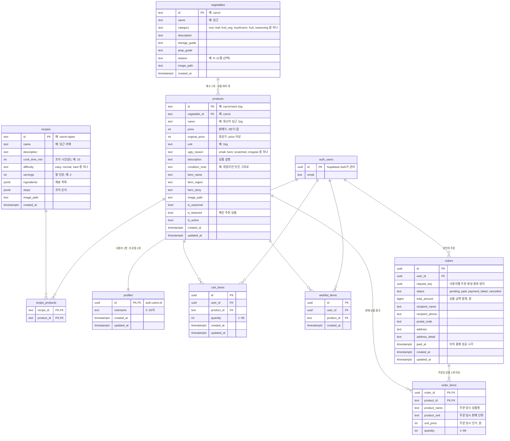

# 못난이마켓 ERD (초안)

> 작성일: 2026-10-07 · 상태: **초안 v4 (DB 담당 검토 전)** · v2: `products.is_featured` 추가 · v3: `products.description` 추가
> 수정일: 2026-10-08 · v4: 주문 생성·모의 결제·주문 내역 추가 (`orders`, `order_items`)
> 기준 문서: 팀 개발 가이드 8장 "데이터베이스 설계"

이번 버전의 구매 흐름은 **로그인 → 주문 생성 → 모의 결제 성공/실패 → 주문 내역 조회**예요. 모의 결제는 실제 돈이 오가지 않는 프로젝트 시연 기능이며, 화면에도 "모의 결제"라고 표시해요. 실제 PG 연동, 재고 관리, 배송 추적, 환불은 이번 범위에 포함하지 않아요.

## 1. 전체 관계도



`auth_users`는 우리가 만드는 테이블이 아니라 **Supabase Auth가 자동으로 관리하는 `auth.users`**예요. 그림에서 관계를 보여주려고 넣었어요.

## 2. 테이블별 컬럼 상세

### 2-1. `vegetables` 채소 정보 (담당: B, 누구나 읽기)

"당근"이라는 채소 자체의 정보예요. 특정 농가의 판매 상품과는 구분해요.

| 컬럼 | 타입 | 필수 | 기본값 | 설명·제약 |
| --- | --- | --- | --- | --- |
| `id` | text | PK | | 영문 소문자·하이픈. 예: `carrot` |
| `name` | text | O | | 채소 이름. 예: 당근 |
| `category` | text | O | | `root`(뿌리채소), `leaf`(잎채소), `fruit_veg`(열매채소), `mushroom`(버섯), `fruit`(과일), `seasoning`(양념채소) 중 하나 |
| `description` | text | O | | 채소 소개 |
| `storage_guide` | text | | | 보관법 |
| `prep_guide` | text | | | 손질법 |
| `season` | text | | | 제철. 예: 9~12월 |
| `image_path` | text | | | Storage 상대 경로. 예: `vegetables/carrot.jpg` |
| `created_at` | timestamptz | O | `now()` | |

### 2-2. `products` 판매 상품 (담당: B, 누구나 읽기)

특정 농가가 파는 "못난이 당근 1kg" 같은 실제 판매 상품이에요.

| 컬럼 | 타입 | 필수 | 기본값 | 설명·제약 |
| --- | --- | --- | --- | --- |
| `id` | text | PK | | 예: `carrot-bent-1kg` |
| `vegetable_id` | text | O | | FK → `vegetables.id` |
| `name` | text | O | | 상품명 |
| `price` | integer | O | | 판매가(원). `price > 0` |
| `original_price` | integer | O | | 정상가(원). `original_price >= price` |
| `unit` | text | O | | 판매 단위. 예: 1kg, 4입 |
| `ugly_reason` | text | O | | 필터용 분류. `small`(작아요), `bent`(휘었어요), `scratched`(흠집), `irregular`(모양이 제각각) 중 하나 |
| `description` | text | O | | 상품 설명 (평가표 필수 속성) |
| `condition_note` | text | | | 화면에 보여줄 상태 설명 |
| `farm_name` | text | O | | 농가 이름 |
| `farm_region` | text | | | 지역. 예: 전라남도 해남 |
| `farm_story` | text | | | 농가 소개 |
| `image_path` | text | | | 예: `products/carrot-bent-1kg.jpg` |
| `is_seasonal` | boolean | O | `false` | 제철 상품 여부 |
| `is_featured` | boolean | O | `false` | 메인 "추천 상품"에 보여줄지 여부. `true`인 상품 중 4개를 메인에 표시 |
| `is_active` | boolean | O | `true` | 판매 중 여부. 판매 종료는 삭제 대신 `false` |
| `created_at` | timestamptz | O | `now()` | |
| `updated_at` | timestamptz | O | `now()` | |

- 할인율은 저장하지 않고 `price`와 `original_price`로 계산해요.
- 인덱스: `vegetable_id`, `is_active`
- 카테고리 필터는 `vegetables.category`에 있으므로 `products`와 `vegetables`를 연결(join)해서 조회해요.

### 2-3. `recipes` 레시피 (담당: A, 누구나 읽기)

| 컬럼 | 타입 | 필수 | 기본값 | 설명·제약 |
| --- | --- | --- | --- | --- |
| `id` | text | PK | | 예: `carrot-rapee` |
| `name` | text | O | | 요리 이름 |
| `description` | text | O | | 한 줄 소개 |
| `cook_time_min` | integer | O | | 조리 시간(분). `> 0` |
| `difficulty` | text | O | | `easy`(쉬움), `normal`(보통), `hard`(어려움) |
| `servings` | integer | | | 몇 인분 |
| `ingredients` | jsonb | O | `'[]'` | 재료 목록. 아래 예시 참고 |
| `steps` | jsonb | O | `'[]'` | 조리 순서 문자열 배열 |
| `image_path` | text | | | 예: `recipes/carrot-rapee.jpg` |
| `created_at` | timestamptz | O | `now()` | |

```json
{
  "ingredients": [
    { "name": "당근", "amount": "2개" },
    { "name": "올리브유", "amount": "2큰술" }
  ],
  "steps": ["당근을 얇게 채 썬다.", "소금을 뿌려 10분 둔다.", "드레싱과 버무린다."]
}
```

### 2-4. `recipe_products` 레시피와 판매 상품 연결 (담당: A, 누구나 읽기)

레시피 상세에서 "이 요리에 쓸 수 있는 상품"을 보여주기 위한 연결표예요. 판매하지 않는 재료(올리브유 등)는 `ingredients`에만 적어요.

| 컬럼 | 타입 | 필수 | 설명·제약 |
| --- | --- | --- | --- |
| `recipe_id` | text | PK, FK | → `recipes.id` |
| `product_id` | text | PK, FK | → `products.id` |

- `PRIMARY KEY (recipe_id, product_id)`로 같은 연결이 두 번 들어가지 않아요.
- 인덱스: `product_id` (상품 상세에서 관련 레시피를 찾을 때 사용)

### 2-5. `profiles` 사용자 프로필 (담당: C, 본인만)

| 컬럼 | 타입 | 필수 | 기본값 | 설명·제약 |
| --- | --- | --- | --- | --- |
| `id` | uuid | PK, FK | | → `auth.users.id`, 회원 탈퇴 시 함께 삭제 (`ON DELETE CASCADE`) |
| `nickname` | text | O | | 2~20자 |
| `created_at` | timestamptz | O | `now()` | |
| `updated_at` | timestamptz | O | `now()` | |

### 2-6. `cart_items` 장바구니 (담당: C, 본인만)

| 컬럼 | 타입 | 필수 | 기본값 | 설명·제약 |
| --- | --- | --- | --- | --- |
| `id` | uuid | PK | `gen_random_uuid()` | |
| `user_id` | uuid | O | `auth.uid()` | FK → `auth.users.id`, `ON DELETE CASCADE` |
| `product_id` | text | O | | FK → `products.id` |
| `quantity` | integer | O | `1` | `quantity BETWEEN 1 AND 99` |
| `created_at` | timestamptz | O | `now()` | |
| `updated_at` | timestamptz | O | `now()` | |

- `UNIQUE (user_id, product_id)`: 같은 상품은 한 줄에 수량만 늘어나요.
- 가격은 저장하지 않아요. 금액은 항상 `products.price × quantity`로 계산해요.
- 인덱스: `user_id`

### 2-7. `wishlist_items` 찜 (담당: C, 본인만)

| 컬럼 | 타입 | 필수 | 기본값 | 설명·제약 |
| --- | --- | --- | --- | --- |
| `id` | uuid | PK | `gen_random_uuid()` | |
| `user_id` | uuid | O | `auth.uid()` | FK → `auth.users.id`, `ON DELETE CASCADE` |
| `product_id` | text | O | | FK → `products.id` |
| `created_at` | timestamptz | O | `now()` | |

- `UNIQUE (user_id, product_id)`: 같은 상품을 두 번 찜할 수 없어요.
- 인덱스: `user_id`

### 2-8. `orders` 주문 (담당: 팀 협의, 본인만 읽기)

주문 상태와 받는 사람 정보를 저장해요. 배송지를 프로필과 별도로 저장하므로 이후 사용자 정보가 바뀌어도 주문 당시 배송지를 유지해요. 주문 번호는 `id`를 사용해요.

| 컬럼 | 타입 | 필수 | 기본값 | 설명·제약 |
| --- | --- | --- | --- | --- |
| `id` | uuid | PK | `gen_random_uuid()` | 주문 식별자 |
| `user_id` | uuid | O | | FK → `auth.users.id`, 시연 프로젝트에서는 `ON DELETE CASCADE` |
| `request_key` | uuid | O | | 클라이언트가 주문 시도마다 생성. 동일 요청 재전송에는 같은 값 사용 |
| `status` | text | O | `'pending'` | `pending`, `paid`, `payment_failed`, `cancelled` 중 하나, text + CHECK |
| `total_amount` | bigint | O | | 상품 금액 합계(원). `> 0`, 서버가 주문상품의 `unit_price × quantity` 합으로 계산 |
| `recipient_name` | text | O | | 받는 사람 이름. 공백만 입력 불가 |
| `recipient_phone` | text | O | | 연락처. 문자열로 저장, 서버에서 형식 검증 |
| `postal_code` | text | O | | 우편번호. 국내 주소 기준 숫자 5자리, 앞자리 0 보존 |
| `address` | text | O | | 기본 주소. 공백만 입력 불가 |
| `address_detail` | text | | | 상세 주소 |
| `paid_at` | timestamptz | | | 모의 결제 성공 시 서버에서 설정. `paid`일 때만 값 존재 |
| `created_at` | timestamptz | O | `now()` | 주문 생성 시각 |
| `updated_at` | timestamptz | O | `now()` | 주문 상태 변경 시 자동 갱신 |

- `UNIQUE (user_id, request_key)`: 같은 주문 생성 요청이 재전송돼도 주문을 중복 생성하지 않아요. 같은 키에 다른 상품·수량·배송지를 보내면 오류로 처리해요.
- 인덱스: `(user_id, created_at DESC)` — 본인 주문 내역 최신순 조회.
- 이번 시연은 배송비 0원, 쿠폰·할인코드 없음으로 정해요. `total_amount`는 주문상품 합계와 같아요.
- `CHECK ((status = 'paid' AND paid_at IS NOT NULL) OR (status <> 'paid' AND paid_at IS NULL))`를 적용해요.
- 회원 탈퇴 시 주문과 배송지를 함께 삭제하는 정책은 이번 시연용이에요. 실제 서비스로 확장할 때 보존 정책을 다시 설계해요.

### 2-9. `order_items` 주문상품 (담당: 팀 협의, 본인 주문만 읽기)

가격과 상품명이 바뀌거나 상품 판매가 종료돼도 주문 내역을 유지하기 위한 **주문 당시 정보**예요. 화면은 `products`와의 조인 없이 이 테이블로 상품명·판매 단위·가격을 표시해요.

| 컬럼 | 타입 | 필수 | 설명·제약 |
| --- | --- | --- | --- |
| `order_id` | uuid | PK, FK | → `orders.id`, `ON DELETE CASCADE` |
| `product_id` | text | PK, FK | → `products.id`, `ON DELETE RESTRICT` |
| `product_name` | text | O | 주문 생성 시 `products.name` 복사 |
| `product_unit` | text | O | 주문 생성 시 `products.unit` 복사. 예: 1kg |
| `unit_price` | integer | O | 주문 생성 시 `products.price` 복사. `> 0` |
| `quantity` | integer | O | `BETWEEN 1 AND 99` |

- `PRIMARY KEY (order_id, product_id)`: 한 주문에서 같은 상품은 한 줄로 합쳐요.
- 인덱스: `product_id` — 상품 FK 조회·삭제 검사에 사용.
- 행 금액은 `unit_price::bigint × quantity`로 계산하며 별도 저장하지 않아요.
- 주문 생성 후 상품·수량·단가·배송지는 변경하지 않아요. 수정하려면 미결제 주문을 취소하고 새로 주문해요.
- 판매 종료는 기존 정책대로 `products.is_active = false`로 처리해요. 주문상품에서 참조한 상품은 물리 삭제할 수 없어요.

## 3. 접근 권한 (RLS) 요약

| 테이블 | 읽기 | 쓰기 (추가·수정·삭제) |
| --- | --- | --- |
| `vegetables`, `products`, `recipes`, `recipe_products` | 누구나 (`products`는 `is_active = true`만) | 일반 사용자 불가 (migration·seed로만 입력) |
| `profiles` | 본인만 (`id = auth.uid()`) | 본인만 추가·수정, 삭제 없음 |
| `cart_items` | 본인만 (`user_id = auth.uid()`) | 본인만 추가·수정·삭제 |
| `wishlist_items` | 본인만 (`user_id = auth.uid()`) | 본인만 추가·삭제 |
| `orders` | 본인만 (`user_id = auth.uid()`) | 일반 사용자 직접 쓰기 불가. 인증된 서버 또는 제한된 RPC에서만 생성·상태 변경 |
| `order_items` | 연결된 `orders.user_id = auth.uid()`인 행만 | 일반 사용자 직접 쓰기 불가. 주문 생성 트랜잭션에서만 추가 |

- 신규 두 테이블 모두 RLS를 활성화하고, 일반 사용자에게는 위 SELECT 정책만 허용해요. 기존 일반 사용자 쓰기 정책을 그대로 복사하지 않아요.
- 주문 RPC를 사용한다면 호출 대상은 `authenticated`로 제한하고, 로그인 여부와 주문 소유권을 함수 내부에서도 확인해요. `user_id`는 클라이언트 입력을 받지 않고 `auth.uid()`에서 정해요.
- 서버의 특권 DB 연결은 RLS를 우회할 수 있으므로 서버에서도 검증된 로그인 사용자와 주문 소유권을 확인해야 해요.
- 사용자에게 상품명·단가·총액·`status`·`paid_at`을 직접 지정하거나 변경할 권한을 주지 않아요.

### 3-1. 주문 생성·모의 결제 처리 규칙

1. **주문 생성**: 상품 ID와 수량, 배송지, `request_key`만 받아요. 서버/DB 함수는 로그인 사용자와 입력을 검증하고, 중복 상품 ID는 수량을 합산해 1~99인지 확인해요. `is_active = true`인 상품의 현재 이름·단위·가격을 DB에서 읽어 주문 당시 정보로 저장해요.
2. **트랜잭션**: 상품을 읽어 저장하는 동안 변경되지 않도록 잠금 등으로 일관성을 보장해요. 주문상품 1개 이상, 서버가 계산한 총액, 주문 헤더와 주문상품 저장을 한 트랜잭션으로 처리해요. 실패하면 전부 롤백해요. 총액과 상품 개수는 다른 테이블을 참조하므로 일반 CHECK만으로 보장할 수 없고 생성 함수에서 검증해요. 중복 요청은 UNIQUE 제약과 충돌 처리를 통해 기존 주문을 반환해요.
3. **모의 결제 성공**: 본인 주문의 상태를 잠그고 확인한 뒤 `pending` 또는 `payment_failed`에서 `paid`로 변경하고 `paid_at`을 설정해요. 이미 `paid`면 기존 성공 결과를 반환해요. 주문 생성 때 확정한 단가로 처리해요.
4. **모의 결제 실패·재시도**: `pending → payment_failed`, 재시도 시 `payment_failed → pending`으로 변경해요. 성공·실패·취소 처리 모두 같은 주문 행을 잠그거나 조건부 UPDATE로 처리해 동시 요청이 완료 상태를 덮어쓰지 못하게 해요. 실패는 `paid` 주문을 변경하지 않아요.
5. **취소**: `pending` 또는 `payment_failed`에서만 `cancelled`로 변경해요. `paid`와 `cancelled`는 이번 범위의 최종 상태예요. 결제 후 취소·환불은 구현하지 않아요.
6. **장바구니**: 이번 버전에서는 주문·결제 처리로 장바구니를 자동 삭제하지 않아요. 주문 중 추가·수정한 상품이 사라지는 상황을 피하고, 사용자가 직접 장바구니를 정리해요.
7. **주문 내역**: 본인 주문과 주문 당시 상품 정보를 최신순으로 보여줘요. `paid`의 표시 문구는 "모의 결제 완료"로 해요. 판매 종료 상품도 주문상품의 저장된 정보로 표시할 수 있어요.

## 4. 초기 데이터 ID (seed 기준)

준비된 사진(`docs/photos/`)에 맞춘 초기 ID 제안이에요.

| 채소 `vegetables.id` | 상품 `products.id` | 못난이 사유 | 메인 추천 `is_featured` | 사진 |
| --- | --- | --- | --- | --- |
| `carrot` | `carrot-bent-1kg` | `bent` | `true` | `carrot.jpg` |
| `apple` | `apple-scratched-2kg` | `scratched` | `true` | `apple.jpg` |
| `shiitake` | `shiitake-irregular-500g` | `irregular` | `true` | `shiitake.jpg` |
| `cabbage` | `cabbage-small-1ea` | `small` | `true` | `cabbage.jpg` |
| `paprika` | `paprika-irregular-4ea` | `irregular` | `false` | `paprika.jpg` |
| `onion` | `onion-small-2kg` | `small` | `false` | `onion.jpg` |

## 4-1. 팀 개발 가이드(8장)와 달라진 점

| 테이블 | 가이드에 없던 컬럼 | 이유 |
| --- | --- | --- |
| `vegetables` | `season`, `created_at` | 채소 정보에 제철 표시, 생성 시각 기록 |
| `products` | `description`, `is_featured`, `created_at`, `updated_at` | 평가표 필수 속성(설명), 메인 추천 상품 선택, 최신순 정렬, 수정 기록 |
| `recipes` | `cook_time_min`, `difficulty`, `servings`, `created_at` | 레시피 카드의 "15분 · 쉬움" 표시 (목업 기준) |
| `profiles` | `created_at` | 가입 시각 기록 |
| `orders` (신규) | 전체 컬럼 | 주문 상태, 중복 요청 방지, 주문 총액, 배송지, 모의 결제 시각 |
| `order_items` (신규) | 전체 컬럼 | 주문 당시 상품명·판매 단위·단가·수량 기록 |

## 5. 정해야 할 것 (DB 담당과 확인)

- [ ] `category`, `ugly_reason`, `difficulty`를 **text + CHECK 제약**으로 할지, **PostgreSQL enum 타입**으로 할지
- [ ] `updated_at` 자동 갱신 트리거를 넣을지
- [ ] 회원가입 시 `profiles`를 **트리거로 자동 생성**할지, 첫 로그인 때 서버에서 생성할지
- [ ] 장바구니 수량 합산을 RPC 함수로 처리할지 (동시에 담을 때 수량 유실 방지)
- [ ] 주문·주문상품 및 모의 결제 기능 담당자 정하기
- [ ] 인증된 서버 API 또는 제한된 RPC 중 주문 처리 방식 정하기 (트랜잭션·소유권 검사 필수)
- [ ] 주문 생성 중복 요청, 동시 모의 결제, 잘못된 금액 입력, 타인 주문 접근을 검증하기
- [x] 구매 범위: 주문 생성·모의 결제·주문 내역, 배송비 0원
- [x] 주문 `status`: text + CHECK, 신규 `orders.updated_at`: 자동 갱신 트리거

## 6. dbdiagram.io용 코드

[dbdiagram.io](https://dbdiagram.io)에 아래 코드를 붙여 넣으면 ERD 그림을 바로 볼 수 있어요. 아래 `note`는 설명이며 실행되는 CHECK 제약이 아니에요. 실제 migration에는 본문의 CHECK·RLS·트랜잭션 규칙을 별도로 구현해야 해요.

```dbml
Table vegetables {
  id text [pk, note: 'carrot']
  name text [not null]
  category text [not null, note: 'root, leaf, fruit_veg, mushroom, fruit, seasoning']
  description text [not null]
  storage_guide text
  prep_guide text
  season text
  image_path text
  created_at timestamptz [not null, default: `now()`]
}

Table products {
  id text [pk, note: 'carrot-bent-1kg']
  vegetable_id text [not null, ref: > vegetables.id]
  name text [not null]
  price int [not null, note: '> 0']
  original_price int [not null, note: '>= price']
  unit text [not null]
  ugly_reason text [not null, note: 'small, bent, scratched, irregular']
  description text [not null]
  condition_note text
  farm_name text [not null]
  farm_region text
  farm_story text
  image_path text
  is_seasonal bool [not null, default: false]
  is_featured bool [not null, default: false, note: '메인 추천 상품']
  is_active bool [not null, default: true]
  created_at timestamptz [not null, default: `now()`]
  updated_at timestamptz [not null, default: `now()`]
}

Table recipes {
  id text [pk, note: 'carrot-rapee']
  name text [not null]
  description text [not null]
  cook_time_min int [not null]
  difficulty text [not null, note: 'easy, normal, hard']
  servings int
  ingredients jsonb [not null, default: '[]']
  steps jsonb [not null, default: '[]']
  image_path text
  created_at timestamptz [not null, default: `now()`]
}

Table recipe_products {
  recipe_id text [ref: > recipes.id]
  product_id text [ref: > products.id]
  indexes {
    (recipe_id, product_id) [pk]
  }
}

Table auth_users {
  id uuid [pk, note: 'Supabase auth.users']
  email text
}

Table profiles {
  id uuid [pk, ref: - auth_users.id]
  nickname text [not null, note: '2~20자']
  created_at timestamptz [not null, default: `now()`]
  updated_at timestamptz [not null, default: `now()`]
}

Table cart_items {
  id uuid [pk, default: `gen_random_uuid()`]
  user_id uuid [not null, ref: > auth_users.id]
  product_id text [not null, ref: > products.id]
  quantity int [not null, default: 1, note: '1~99']
  created_at timestamptz [not null, default: `now()`]
  updated_at timestamptz [not null, default: `now()`]
  indexes {
    (user_id, product_id) [unique]
  }
}

Table wishlist_items {
  id uuid [pk, default: `gen_random_uuid()`]
  user_id uuid [not null, ref: > auth_users.id]
  product_id text [not null, ref: > products.id]
  created_at timestamptz [not null, default: `now()`]
  indexes {
    (user_id, product_id) [unique]
  }
}

Table orders {
  id uuid [pk, default: `gen_random_uuid()`]
  user_id uuid [not null]
  request_key uuid [not null, note: '사용자별 주문 생성 중복 방지']
  status text [not null, default: 'pending', note: 'pending, paid, payment_failed, cancelled']
  total_amount bigint [not null, note: '> 0, 주문상품 금액 합계, 배송비 0원']
  recipient_name text [not null]
  recipient_phone text [not null]
  postal_code text [not null, note: '국내 우편번호 숫자 5자리']
  address text [not null]
  address_detail text
  paid_at timestamptz [note: '모의 결제 성공 시각, paid 상태일 때만 값 존재']
  created_at timestamptz [not null, default: `now()`]
  updated_at timestamptz [not null, default: `now()`, note: '자동 갱신 트리거']
  indexes {
    (user_id, request_key) [unique]
    (user_id, created_at) [note: '실제 SQL에서는 created_at DESC']
  }
}

Table order_items {
  order_id uuid [not null]
  product_id text [not null]
  product_name text [not null, note: '주문 당시 상품명']
  product_unit text [not null, note: '주문 당시 판매 단위']
  unit_price int [not null, note: '주문 당시 단가, > 0']
  quantity int [not null, note: '1~99']
  indexes {
    (order_id, product_id) [pk]
    product_id
  }
}

Ref: orders.user_id > auth_users.id [delete: cascade]
Ref: order_items.order_id > orders.id [delete: cascade]
Ref: order_items.product_id > products.id [delete: restrict]

```
