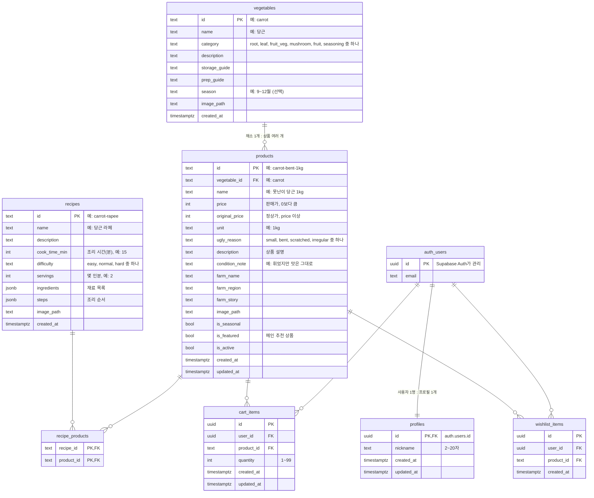

# 못난이마켓 ERD (초안)

> 작성일: 2026-10-07 · 상태: **초안 v3 (DB 담당 검토 전)** · v2: `products.is_featured` 추가 · v3: `products.description` 추가
> 기준 문서: 팀 개발 가이드 8장 "데이터베이스 설계"

## 1. 전체 관계도



`auth_users`는 우리가 만드는 테이블이 아니라 **Supabase Auth가 자동으로 관리하는 `auth.users`**예요. 그림에서 관계를 보여주려고 넣었어요.

## 2. 테이블별 컬럼 상세

### 2-1. `vegetables` 채소 정보 (담당: B, 누구나 읽기)

"당근"이라는 채소 자체의 정보예요. 특정 농가의 판매 상품과는 구분해요.

| 컬럼 | 타입 | 필수 | 기본값 | 설명·제약 |
| --- | --- | --- | --- | --- |
| `id` | text | PK | | 영문 소문자·하이픈. 예: `carrot` |
| `name` | text | O | | 채소 이름. 예: 당근 |
| `category` | text | O | | `root`(뿌리채소), `leaf`(잎채소), `fruit_veg`(열매채소), `mushroom`(버섯), `fruit`(과일), `seasoning`(양념채소) 중 하나 |
| `description` | text | O | | 채소 소개 |
| `storage_guide` | text | | | 보관법 |
| `prep_guide` | text | | | 손질법 |
| `season` | text | | | 제철. 예: 9~12월 |
| `image_path` | text | | | Storage 상대 경로. 예: `vegetables/carrot.jpg` |
| `created_at` | timestamptz | O | `now()` | |

### 2-2. `products` 판매 상품 (담당: B, 누구나 읽기)

특정 농가가 파는 "못난이 당근 1kg" 같은 실제 판매 상품이에요.

| 컬럼 | 타입 | 필수 | 기본값 | 설명·제약 |
| --- | --- | --- | --- | --- |
| `id` | text | PK | | 예: `carrot-bent-1kg` |
| `vegetable_id` | text | O | | FK → `vegetables.id` |
| `name` | text | O | | 상품명 |
| `price` | integer | O | | 판매가(원). `price > 0` |
| `original_price` | integer | O | | 정상가(원). `original_price >= price` |
| `unit` | text | O | | 판매 단위. 예: 1kg, 4입 |
| `ugly_reason` | text | O | | 필터용 분류. `small`(작아요), `bent`(휘었어요), `scratched`(흠집), `irregular`(모양이 제각각) 중 하나 |
| `description` | text | O | | 상품 설명 (평가표 필수 속성) |
| `condition_note` | text | | | 화면에 보여줄 상태 설명 |
| `farm_name` | text | O | | 농가 이름 |
| `farm_region` | text | | | 지역. 예: 전라남도 해남 |
| `farm_story` | text | | | 농가 소개 |
| `image_path` | text | | | 예: `products/carrot-bent-1kg.jpg` |
| `is_seasonal` | boolean | O | `false` | 제철 상품 여부 |
| `is_featured` | boolean | O | `false` | 메인 "추천 상품"에 보여줄지 여부. `true`인 상품 중 4개를 메인에 표시 |
| `is_active` | boolean | O | `true` | 판매 중 여부. 판매 종료는 삭제 대신 `false` |
| `created_at` | timestamptz | O | `now()` | |
| `updated_at` | timestamptz | O | `now()` | |

- 할인율은 저장하지 않고 `price`와 `original_price`로 계산해요.
- 인덱스: `vegetable_id`, `is_active`
- 카테고리 필터는 `vegetables.category`에 있으므로 `products`와 `vegetables`를 연결(join)해서 조회해요.

### 2-3. `recipes` 레시피 (담당: A, 누구나 읽기)

| 컬럼 | 타입 | 필수 | 기본값 | 설명·제약 |
| --- | --- | --- | --- | --- |
| `id` | text | PK | | 예: `carrot-rapee` |
| `name` | text | O | | 요리 이름 |
| `description` | text | O | | 한 줄 소개 |
| `cook_time_min` | integer | O | | 조리 시간(분). `> 0` |
| `difficulty` | text | O | | `easy`(쉬움), `normal`(보통), `hard`(어려움) |
| `servings` | integer | | | 몇 인분 |
| `ingredients` | jsonb | O | `'[]'` | 재료 목록. 아래 예시 참고 |
| `steps` | jsonb | O | `'[]'` | 조리 순서 문자열 배열 |
| `image_path` | text | | | 예: `recipes/carrot-rapee.jpg` |
| `created_at` | timestamptz | O | `now()` | |

```json
{
  "ingredients": [
    { "name": "당근", "amount": "2개" },
    { "name": "올리브유", "amount": "2큰술" }
  ],
  "steps": ["당근을 얇게 채 썬다.", "소금을 뿌려 10분 둔다.", "드레싱과 버무린다."]
}
```

### 2-4. `recipe_products` 레시피와 판매 상품 연결 (담당: A, 누구나 읽기)

레시피 상세에서 "이 요리에 쓸 수 있는 상품"을 보여주기 위한 연결표예요. 판매하지 않는 재료(올리브유 등)는 `ingredients`에만 적어요.

| 컬럼 | 타입 | 필수 | 설명·제약 |
| --- | --- | --- | --- |
| `recipe_id` | text | PK, FK | → `recipes.id` |
| `product_id` | text | PK, FK | → `products.id` |

- `PRIMARY KEY (recipe_id, product_id)`로 같은 연결이 두 번 들어가지 않아요.
- 인덱스: `product_id` (상품 상세에서 관련 레시피를 찾을 때 사용)

### 2-5. `profiles` 사용자 프로필 (담당: C, 본인만)

| 컬럼 | 타입 | 필수 | 기본값 | 설명·제약 |
| --- | --- | --- | --- | --- |
| `id` | uuid | PK, FK | | → `auth.users.id`, 회원 탈퇴 시 함께 삭제 (`ON DELETE CASCADE`) |
| `nickname` | text | O | | 2~20자 |
| `created_at` | timestamptz | O | `now()` | |
| `updated_at` | timestamptz | O | `now()` | |

### 2-6. `cart_items` 장바구니 (담당: C, 본인만)

| 컬럼 | 타입 | 필수 | 기본값 | 설명·제약 |
| --- | --- | --- | --- | --- |
| `id` | uuid | PK | `gen_random_uuid()` | |
| `user_id` | uuid | O | `auth.uid()` | FK → `auth.users.id`, `ON DELETE CASCADE` |
| `product_id` | text | O | | FK → `products.id` |
| `quantity` | integer | O | `1` | `quantity BETWEEN 1 AND 99` |
| `created_at` | timestamptz | O | `now()` | |
| `updated_at` | timestamptz | O | `now()` | |

- `UNIQUE (user_id, product_id)`: 같은 상품은 한 줄에 수량만 늘어나요.
- 가격은 저장하지 않아요. 금액은 항상 `products.price × quantity`로 계산해요.
- 인덱스: `user_id`

### 2-7. `wishlist_items` 찜 (담당: C, 본인만)

| 컬럼 | 타입 | 필수 | 기본값 | 설명·제약 |
| --- | --- | --- | --- | --- |
| `id` | uuid | PK | `gen_random_uuid()` | |
| `user_id` | uuid | O | `auth.uid()` | FK → `auth.users.id`, `ON DELETE CASCADE` |
| `product_id` | text | O | | FK → `products.id` |
| `created_at` | timestamptz | O | `now()` | |

- `UNIQUE (user_id, product_id)`: 같은 상품을 두 번 찜할 수 없어요.
- 인덱스: `user_id`

## 3. 접근 권한 (RLS) 요약

| 테이블 | 읽기 | 쓰기 (추가·수정·삭제) |
| --- | --- | --- |
| `vegetables`, `products`, `recipes`, `recipe_products` | 누구나 (`products`는 `is_active = true`만) | 일반 사용자 불가 (migration·seed로만 입력) |
| `profiles` | 본인만 (`id = auth.uid()`) | 본인만 추가·수정, 삭제 없음 |
| `cart_items` | 본인만 (`user_id = auth.uid()`) | 본인만 추가·수정·삭제 |
| `wishlist_items` | 본인만 (`user_id = auth.uid()`) | 본인만 추가·삭제 |

## 4. 초기 데이터 ID (seed 기준)

준비된 사진(`docs/photos/`)에 맞춘 초기 ID 제안이에요.

| 채소 `vegetables.id` | 상품 `products.id` | 못난이 사유 | 메인 추천 `is_featured` | 사진 |
| --- | --- | --- | --- | --- |
| `carrot` | `carrot-bent-1kg` | `bent` | `true` | `carrot.jpg` |
| `apple` | `apple-scratched-2kg` | `scratched` | `true` | `apple.jpg` |
| `shiitake` | `shiitake-irregular-500g` | `irregular` | `true` | `shiitake.jpg` |
| `cabbage` | `cabbage-small-1ea` | `small` | `true` | `cabbage.jpg` |
| `paprika` | `paprika-irregular-4ea` | `irregular` | `false` | `paprika.jpg` |
| `onion` | `onion-small-2kg` | `small` | `false` | `onion.jpg` |

## 4-1. 팀 개발 가이드(8장)와 달라진 점

| 테이블 | 가이드에 없던 컬럼 | 이유 |
| --- | --- | --- |
| `vegetables` | `season`, `created_at` | 채소 정보에 제철 표시, 생성 시각 기록 |
| `products` | `description`, `is_featured`, `created_at`, `updated_at` | 평가표 필수 속성(설명), 메인 추천 상품 선택, 최신순 정렬, 수정 기록 |
| `recipes` | `cook_time_min`, `difficulty`, `servings`, `created_at` | 레시피 카드의 "15분 · 쉬움" 표시 (목업 기준) |
| `profiles` | `created_at` | 가입 시각 기록 |

## 5. 정해야 할 것 (DB 담당과 확인)

- [ ] `category`, `ugly_reason`, `difficulty`를 **text + CHECK 제약**으로 할지, **PostgreSQL enum 타입**으로 할지
- [ ] `updated_at` 자동 갱신 트리거를 넣을지
- [ ] 회원가입 시 `profiles`를 **트리거로 자동 생성**할지, 첫 로그인 때 서버에서 생성할지
- [ ] 장바구니 수량 합산을 RPC 함수로 처리할지 (동시에 담을 때 수량 유실 방지)

## 6. dbdiagram.io용 코드

[dbdiagram.io](https://dbdiagram.io)에 아래 코드를 붙여 넣으면 ERD 그림을 바로 볼 수 있어요.

```dbml
Table vegetables {
  id text [pk, note: 'carrot']
  name text [not null]
  category text [not null, note: 'root, leaf, fruit_veg, mushroom, fruit, seasoning']
  description text [not null]
  storage_guide text
  prep_guide text
  season text
  image_path text
  created_at timestamptz [not null, default: `now()`]
}

Table products {
  id text [pk, note: 'carrot-bent-1kg']
  vegetable_id text [not null, ref: > vegetables.id]
  name text [not null]
  price int [not null, note: '> 0']
  original_price int [not null, note: '>= price']
  unit text [not null]
  ugly_reason text [not null, note: 'small, bent, scratched, irregular']
  description text [not null]
  condition_note text
  farm_name text [not null]
  farm_region text
  farm_story text
  image_path text
  is_seasonal bool [not null, default: false]
  is_featured bool [not null, default: false, note: '메인 추천 상품']
  is_active bool [not null, default: true]
  created_at timestamptz [not null, default: `now()`]
  updated_at timestamptz [not null, default: `now()`]
}

Table recipes {
  id text [pk, note: 'carrot-rapee']
  name text [not null]
  description text [not null]
  cook_time_min int [not null]
  difficulty text [not null, note: 'easy, normal, hard']
  servings int
  ingredients jsonb [not null, default: '[]']
  steps jsonb [not null, default: '[]']
  image_path text
  created_at timestamptz [not null, default: `now()`]
}

Table recipe_products {
  recipe_id text [ref: > recipes.id]
  product_id text [ref: > products.id]
  indexes {
    (recipe_id, product_id) [pk]
  }
}

Table auth_users {
  id uuid [pk, note: 'Supabase auth.users']
  email text
}

Table profiles {
  id uuid [pk, ref: - auth_users.id]
  nickname text [not null, note: '2~20자']
  created_at timestamptz [not null, default: `now()`]
  updated_at timestamptz [not null, default: `now()`]
}

Table cart_items {
  id uuid [pk, default: `gen_random_uuid()`]
  user_id uuid [not null, ref: > auth_users.id]
  product_id text [not null, ref: > products.id]
  quantity int [not null, default: 1, note: '1~99']
  created_at timestamptz [not null, default: `now()`]
  updated_at timestamptz [not null, default: `now()`]
  indexes {
    (user_id, product_id) [unique]
  }
}

Table wishlist_items {
  id uuid [pk, default: `gen_random_uuid()`]
  user_id uuid [not null, ref: > auth_users.id]
  product_id text [not null, ref: > products.id]
  created_at timestamptz [not null, default: `now()`]
  indexes {
    (user_id, product_id) [unique]
  }
}
```
