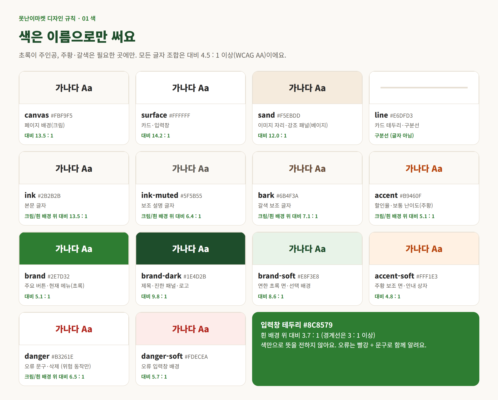
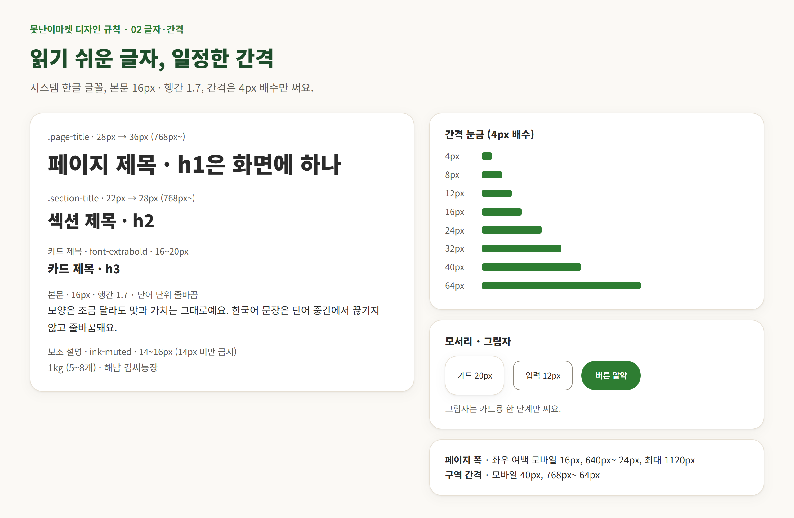
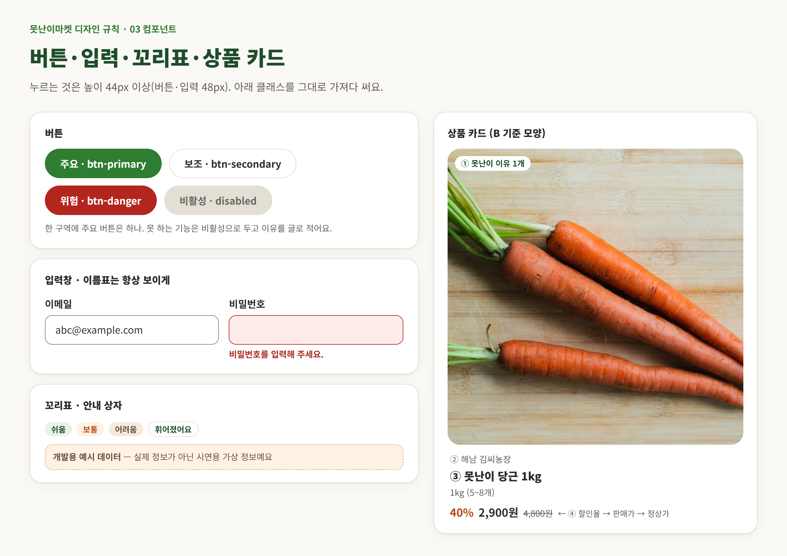
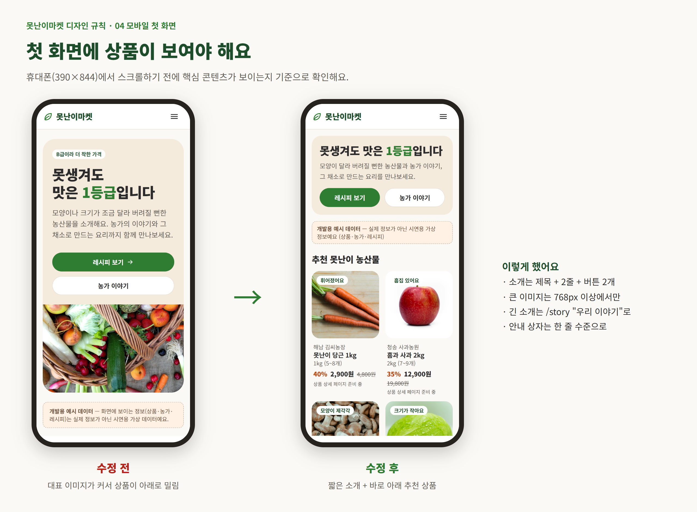

# 못난이마켓 디자인 규칙

> 상태: **확정** (팀 확인 완료 2026-10-08) · 작성 2026-10-08 · 담당 A
> 이 규칙을 구현한 코드는 `src/app/globals.css`(값)와 `src/components/common/`(공통 컴포넌트)에 있어요. 바꾸려면 아래 "규칙을 바꾸고 싶을 때"를 따라요.

## 한눈에 보기









A·B·C 모두 이 규칙으로 화면을 만들어요. 값은 [`src/app/globals.css`](../src/app/globals.css) 한 곳에서만 정의하고, 화면에서는 **이름**(`bg-canvas`, `text-ink-muted`, `btn btn-primary` …)으로 가져다 써요. 새 색이나 새 간격이 필요하면 화면에서 직접 만들지 말고 아래 "규칙을 바꾸고 싶을 때"를 따라요.

## 1. 먼저 지킬 7가지

1. **색은 이름으로만 써요.** `#2e7d32`, `bg-green-600`, `text-gray-500` 같은 직접 값 금지. (`bg-brand`, `text-ink-muted` …)
2. **초록(`brand`)이 주인공이에요.** 주황·갈색은 할인율·난이도·안내처럼 필요한 곳에만 써요.
3. **모바일부터 만들고 넓은 화면에서 넓혀요.** 모바일 360px에서 가로 스크롤이 생기면 안 돼요.
4. **메인·목록은 스크롤하지 않은 휴대폰 첫 화면에 핵심 콘텐츠(상품·카드 사진)가 보여야 해요.** 소개 글은 짧게, 긴 설명은 `/story`로.
5. **누르는 것은 높이 44px 이상**이에요. `.btn`(48px), `.field`(48px)을 그대로 쓰면 돼요.
6. **동작하지 않는 버튼은 만들지 않아요.** 아직 못 하는 기능은 숨기거나 비활성(`disabled`)으로 이유와 함께 보여줘요.
7. **사진이 없거나 실패해도 화면이 깨지면 안 돼요.** 이미지는 `SafeImage`로 그려요.

## 2. 색

| 이름(클래스)             | 값                    | 쓰는 곳                                  | 대비            |
| ------------------------ | --------------------- | ---------------------------------------- | --------------- |
| `canvas`                 | `#FBF9F5`             | 페이지 배경(크림)                        | —               |
| `surface`                | `#FFFFFF`             | 카드·입력창                              | —               |
| `sand`                   | `#F5EBDD`             | 이미지 자리, 강조 패널(베이지)           | —               |
| `ink`                    | `#2B2B2B`             | 본문                                     | 13.5 : 1        |
| `ink-muted`              | `#5F5B55`             | 보조 설명                                | 6.4 : 1         |
| `line`                   | `#E6DFD3`             | 카드 테두리·구분선                       | —               |
| `brand`                  | `#2E7D32`             | 주요 버튼, 현재 메뉴, 링크 강조          | 흰 글자 5.1 : 1 |
| `brand-dark`             | `#1E4D2B`             | 제목·진한 패널·로고                      | 흰 글자 9.8 : 1 |
| `brand-soft`             | `#E8F3E8`             | 연한 초록 면, 선택된 항목 배경           | 8.6 : 1         |
| `accent`                 | `#B9460F`             | **할인율**, 보통 난이도                  | 크림 5.1 : 1    |
| `accent-soft`            | `#FFF1E3`             | 주황 보조 면, 안내 상자                  | —               |
| `bark`                   | `#6B4F3A`             | 갈색 보조 글자                           | 6.8 : 1         |
| `danger` / `danger-soft` | `#B3261E` / `#FDECEA` | **오류 문구, 삭제 같은 위험한 동작에만** | 흰색 6.5 : 1    |
| (입력창 테두리)          | `#8C8579`             | `.field`가 자동 적용                     | 흰색 3.7 : 1    |

- 글자·배경 조합은 모두 WCAG AA(일반 글자 4.5 : 1) 이상이에요. 새 조합은 대비를 먼저 계산해요.
- **색만으로 뜻을 전하지 않아요.** 오류는 빨간색과 함께 문구를, 난이도는 색과 함께 "쉬움/보통/어려움"을 써요.
- 그림자·그라데이션·형광색·광고 같은 배너·팝업 쿠폰은 쓰지 않아요.

## 3. 글자

- 글꼴은 시스템 한글 글꼴(`Pretendard → Apple SD Gothic Neo → Noto Sans KR → Malgun Gothic`)이에요. 웹폰트를 내려받지 않아요. 바꾸려면 팀 합의 후 `next/font/local`로 추가해요.
- 본문 16px, 행간 1.7. 한국어는 단어 단위로 줄바꿈(`keep-all`)하고, 긴 문자열은 넘치지 않고 줄바꿈돼요.

| 용도                          | 클래스           | 크기                     |
| ----------------------------- | ---------------- | ------------------------ |
| 페이지 제목 `h1` (화면당 1개) | `.page-title`    | 28px → 36px(768px~)      |
| 섹션 제목 `h2`                | `.section-title` | 22px → 28px(768px~)      |
| 카드 제목 `h3`                | `font-extrabold` | 16~20px                  |
| 보조 설명                     | `text-ink-muted` | 14~16px (14px 미만 금지) |

제목은 `h1 → h2 → h3` 순서를 건너뛰지 않아요. 크기를 맞추려고 제목 태그를 바꾸지 말고 클래스로 조절해요.

## 4. 간격·모서리·그림자

| 항목                               | 값                                                                                    |
| ---------------------------------- | ------------------------------------------------------------------------------------- |
| 페이지 좌우 여백 `.container-page` | 모바일 16px, 640px~ 24px, 최대 폭 1120px                                              |
| 세로 구역 간격 `.section`          | 모바일 40px, 768px~ 64px                                                              |
| 카드 안쪽 여백                     | 16~24px (`p-4` ~ `p-6`)                                                               |
| 카드·입력 사이 간격                | 16px(`gap-4`), 넓은 화면 24px(`gap-6`)                                                |
| 모서리                             | 카드 `rounded-card`(20px), 입력창 `rounded-control`(12px), 버튼·꼬리표 `rounded-full` |
| 그림자                             | 카드용 한 단계(`.card`에 포함). 다른 그림자 금지                                      |

간격은 4px 배수(Tailwind 기본 단위)만 써요. `mt-[13px]` 같은 임의 값은 쓰지 않아요.

## 5. 페이지 뼈대

```tsx
// 일반 페이지
<div className="container-page section">
  <h1 className="page-title">제목</h1>
  <p className="mt-3 text-ink-muted">한두 문장 소개</p>
  {/* 본문 */}
</div>

// 배경이 다른 구역(크림 ↔ 베이지를 번갈아 써서 구역을 나눠요)
<section aria-labelledby="x-title" className="bg-sand/50">
  <div className="container-page section">
    <h2 id="x-title" className="section-title">구역 제목</h2>
  </div>
</section>
```

- 헤더·푸터·`layout.tsx`는 C가 관리해요. 각 페이지는 본문(`main` 안)만 만들어요.
- 데이터가 없을 때(빈 상태), 불러오는 중, 오류, 404를 모두 만들어요. 빈 상태는 `.card` 가운데 정렬로 **이유 + 다음 행동 버튼**을 보여줘요. (예: `RecipeResults`의 "조건에 맞는 레시피가 없어요")

## 6. 컴포넌트 규칙

### 버튼

| 종류   | 클래스                                 | 언제                                            |
| ------ | -------------------------------------- | ----------------------------------------------- |
| 주요   | `btn btn-primary`                      | 화면당 가장 중요한 행동 하나 (담기, 검색 등)    |
| 보조   | `btn btn-secondary`                    | 그 밖의 행동 (목록으로, 취소)                   |
| 위험   | `btn btn-danger`                       | 삭제 같은 되돌리기 어려운 행동                  |
| 비활성 | `disabled` 또는 `aria-disabled="true"` | 지금 할 수 없는 행동. 이유를 근처에 글로 적어요 |

- 한 구역에 주요 버튼은 하나만 둬요. 글자는 짧은 동사형("레시피 보기", "장바구니 담기").
- 모바일에서 버튼 두 개는 가로로 나란히(`flex-1`), 글자가 두 줄로 꺾이면 아이콘을 빼요.
- 처리 중에는 버튼을 비활성으로 바꿔 중복 클릭을 막아요.

### 입력창 (로그인·검색·수량)

```tsx
<label htmlFor="email" className="field-label">이메일</label>
<input id="email" className="field" aria-invalid={!!error} aria-describedby="email-error" />
{error && <p id="email-error" className="field-error">{error}</p>}
```

- 이름표(`label`)는 **항상 보이게** 써요. 검색창처럼 버튼이 설명을 대신하면 `sr-only` 라벨을 써요.
- 글자 16px 이상(`.field`가 보장). 이메일은 `type="email"`·`autoComplete`를 지정해요.
- 오류는 입력창 **아래에 문구로** 써요. 서버 오류에 DB 내부 정보·키를 싣지 않아요.

### 카드 `.card`

이미지 → 제목 → 짧은 설명(최대 2줄, `line-clamp-2`) → 부가 정보 순서. 카드 전체를 하나의 링크로 만들어 누르기 쉽게 해요. 카드 안에서 DB를 조회하지 않고 값은 props로 받아요.

### 상품 카드 (B 필독)

`ProductPreviewCard`(`components/common`)가 기준 모양이에요. B의 `ProductCard`도 같은 순서를 따라요.

1. 정사각(`aspect-square`) 사진, 왼쪽 위에 **못난이 이유 꼬리표 1개**(`chip`)
2. 농가 이름(작은 보조 글자)
3. 상품명(굵게) · 단위(보조)
4. 가격 줄: **할인율(`text-accent`, 굵게) → 판매가(굵게) → 정상가(취소선, 보조색)**

가격은 항상 `formatPrice()`, 할인율은 `getDiscountRate()`(`src/lib/format.ts`)로 계산해요. 직접 문자열을 만들지 않아요. 모바일 2열, 데스크톱 4열.

### 꼬리표 `.chip`

짧은 한 단어~구(못난이 이유, 난이도). 배경/글자 쌍은 `bg-brand-soft text-brand-dark`, `bg-accent-soft text-accent`, `bg-sand text-bark`, 사진 위에서는 `bg-surface text-brand-dark`.

### 수량 선택기·아이콘 버튼 (B·C)

누르는 영역 44×44px 이상, 글자(수량)는 16px 이상, `−`/`+` 버튼에는 `aria-label`(예: "수량 줄이기")을 붙여요. 아이콘은 `components/common/Icons.tsx`의 것을 쓰고 장식이면 `aria-hidden`이에요.

### 안내 상자

- **개발용 예시 데이터**: `MockDataNotice`가 Mock 모드에서만 자동으로 보여줘요.
- 성공·실패 안내는 화면 안에 글로 보여주고, 사라지는 팝업만으로 알리지 않아요.

## 7. 이미지

| 용도                        | 비율                    | 비고              |
| --------------------------- | ----------------------- | ----------------- |
| 상품 카드                   | 1 : 1 (`aspect-square`) | `object-cover`    |
| 레시피 카드·상세, 농가 카드 | 4 : 3 (`aspect-[4/3]`)  | `object-cover`    |
| 채소 동그라미               | 80~96px 원형            | 장식이면 `alt=""` |

- **항상 `SafeImage`**를 써요. 사진이 없거나 실패하면 외부 이미지 없이 그려지는 대체 화면이 나와요.
- `alt`는 "무엇이 찍혔는지"를 써요(예: "해남 김씨농장의 못난이 당근 사진"). "이미지", "사진"만 쓰지 않아요.
- 임시 이미지는 임시임을 화면에 밝혀요(레시피: "재료 사진 · 요리 사진 준비 중").
- 새 이미지는 사용 조건을 확인하고 [`docs/image-sources.md`](image-sources.md)에 출처를 적어요. 긴 변 약 1200px, 1MB 이내, 파일명은 영문 소문자·하이픈.

## 8. 반응형·모바일

Tailwind 기본 구간을 써요. 모바일 기준으로 쓰고 `sm:`, `md:`, `lg:`로 넓혀요.

| 구간         | 폭      | 카드(레시피) | 상품 | 헤더        |
| ------------ | ------- | ------------ | ---- | ----------- |
| 기본(모바일) | ~639px  | 1열          | 2열  | 햄버거 메뉴 |
| `sm`         | 640px~  | 2열          | 2열  | 햄버거 메뉴 |
| `md`         | 768px~  | 2열          | 2열  | 가로 메뉴   |
| `lg`         | 1024px~ | 3열          | 4열  | 가로 메뉴   |

- 확인할 폭: **360 · 390 · 768 · 1280px**. 가로 스크롤·이미지 넘침·글자 겹침이 없어야 해요.
- **첫 화면 규칙:** 메인·목록은 스크롤하지 않은 휴대폰(390×844, 360×740) 화면에서 핵심 콘텐츠(상품 또는 첫 카드의 사진)가 보여야 해요. 메인 상품은 390px에서 제목과 첫 줄이 모두, 레시피 목록은 첫 카드 사진이 보이는 것을 기준으로 확인했어요. 소개 영역은 제목 + 2줄 + 버튼으로 줄이고 큰 이미지는 `md:` 이상에서만 보여줘요.
- `hover`에만 나타나는 기능을 만들지 않아요. 확대를 막는 viewport 설정을 쓰지 않아요.
- 화면 아래에 고정되는 영역(하단 담기 버튼)은 본문 마지막이 가려지지 않게 여백을 둬요(`env(safe-area-inset-bottom)`).

## 9. 접근성 체크

- [ ] `h1` 하나, 제목 순서 유지 · 구역에는 `aria-labelledby`
- [ ] 키보드 Tab으로 모든 행동에 도달하고, 포커스 윤곽선(3px 초록)이 보임 (제거 금지)
- [ ] 모든 입력에 이름표, 버튼·링크에 읽히는 이름(아이콘만이면 `aria-label` 또는 `sr-only`)
- [ ] 이미지 `alt`, 결과 개수·상태 변경은 `role="status"`
- [ ] 현재 위치 표시(`aria-current`), 모달·메뉴는 Esc로 닫히고 포커스가 돌아옴
- [ ] 글자·배경 대비 4.5 : 1 이상, 색만으로 구분하지 않음

## 10. 문구

- 말투는 **"~해요" 체**로 통일해요. 짧고 쉽게 써요. (예: "장바구니에 담았어요")
- 서비스 이름은 **못난이마켓**만 써요.
- 팀이 정하지 않은 **배송·환불·품질 보증·무료배송·고객센터** 문구는 화면에 쓰지 않아요.
- 실제 자료가 아닌 농가·상품·레시피는 시연용(가상)임을 밝혀요. 실존 농가·인증·인터뷰를 지어내지 않아요.
- 오류 문구는 "무슨 일이 일어났는지 + 다음에 할 일"을 써요. (예: "정보를 불러오지 못했어요. 잠시 뒤 다시 시도해 주세요.")

## 11. 새 화면 PR 전 체크리스트

- [ ] 색·간격·모서리를 이름으로 썼다 (`#` 값, `[13px]` 같은 임의 값 없음)
- [ ] 360 / 390 / 768 / 1280px에서 가로 스크롤 없음, 첫 화면에 핵심 콘텐츠가 보임
- [ ] 누르는 요소 44px 이상, 키보드로 모두 사용 가능
- [ ] 빈 상태·오류·이미지 실패·404를 확인했다
- [ ] 동작하지 않는 버튼이 없다
- [ ] `npm run lint`, `npm run typecheck`, `npm run format:check`, `npm run build` 통과
- [ ] Desktop·Mobile 캡처를 PR에 첨부했다

## 12. 규칙을 바꾸고 싶을 때

1. `globals.css`의 값을 바꾸면 **모든 화면이 함께 바뀌어요.** PR 설명에 이유와 영향 범위(어느 화면)를 적어요.
2. 새 색·새 컴포넌트 규칙은 이 문서에 **같은 PR에서** 추가해요. (문서와 코드가 다르면 안 돼요.)
3. 디자인 규칙의 최종 확정은 A가 하고, 공통 컴포넌트의 최종 코드는 C가 맡아요(README 5장). 의견은 PR 리뷰나 Redmine #5 댓글로 남겨요.

## 13. 공통 파일 위치

| 무엇                                                     | 어디                                                     |
| -------------------------------------------------------- | -------------------------------------------------------- |
| 색·글자·간격·`.btn` `.card` `.chip` `.field` 정의        | `src/app/globals.css`                                    |
| 이미지(실패 대비), 아이콘, 상품 미리보기 카드, Mock 안내 | `src/components/common/`                                 |
| 레시피 카드·상세 부품                                    | `src/components/recipes/`                                |
| 화면 사이 경로(없는 화면 링크 방지)                      | `src/lib/routes.ts`                                      |
| 가격·할인율 표시                                         | `src/lib/format.ts` (B)                                  |
| 이 규칙을 지킨 화면 예시                                 | 메인 `src/app/page.tsx`, 목록 `src/app/recipes/page.tsx` |

## 14. 왜 이렇게 정했나요

근거 표시: **[문서]** 저장소 문서·목업에 있던 내용, **[요청]** 팀 요구사항, **[기준]** 접근성·플랫폼 표준, **[판단]** 작성자(A)의 판단이라 팀이 바꿔도 되는 값.

### 색

| 규칙                                            | 이유                                                                                                             | 근거                                                           |
| ----------------------------------------------- | ---------------------------------------------------------------------------------------------------------------- | -------------------------------------------------------------- |
| 크림 배경 + 베이지 + 초록                       | 농산물이 따뜻하고 친근해 보이고, 사진(당근·사과 등)의 색이 돋보이게 배경을 차분하게 둠                           | [문서] README 16장 "Warm White·Ivory, Beige, Deep Green", 목업 |
| 초록이 주인공, 주황·갈색은 조금만               | 강조색이 여럿이면 어디가 중요한지 흐려지고, 다채로운 상품 사진과 부딪힘. 주황은 할인율처럼 눈에 띄어야 할 곳에만 | [요청] [문서] 목업의 할인율 주황                               |
| 할인 주황을 목업보다 어둡게(`#B9460F`)          | 목업의 밝은 주황은 크림 배경 위 대비가 3.7:1로 작은 글자가 읽기 어려움                                           | [기준] WCAG AA 4.5:1                                           |
| 오류·삭제용 `danger` 빨강을 따로 둠             | 초록(안내)·주황(할인)과 섞이면 "오류"인지 구분이 안 됨                                                           | [판단]                                                         |
| 색은 이름으로만 사용                            | 세 명이 각자 색을 고르면 화면마다 톤이 달라짐. 한 곳(`globals.css`)을 고치면 전체가 바뀜                         | [판단]                                                         |
| 색만으로 뜻을 전하지 않음                       | 색을 구분하기 어려운 사용자와 밝은 야외 화면에서도 같은 정보를 받도록                                            | [기준]                                                         |
| 글자 대비 4.5:1, 입력창 테두리 3:1 이상         | 읽기 쉬움. 입력창 테두리는 처음에 1.8:1이라 미달이어서 `#8C8579`로 진하게 바꿈                                   | [기준] WCAG 1.4.3, 1.4.11                                      |
| 그라데이션·그림자 남발·광고 배너·쿠폰 팝업 금지 | 차분한 신뢰감, 상품 사진이 주인공이 되도록                                                                       | [문서] README 16장                                             |

### 글자

| 규칙                                  | 이유                                                                     | 근거               |
| ------------------------------------- | ------------------------------------------------------------------------ | ------------------ |
| 시스템 한글 글꼴(웹폰트 없음)         | 폰트를 내려받지 않아 빠르고, 외부 사이트나 네트워크가 없어도 빌드·실행됨 | [판단]             |
| 본문 16px, 행간 1.7, 단어 단위 줄바꿈 | 한국어는 줄 간격이 좁으면 답답하고, 단어 중간에서 끊기면 읽기 어려움     | [판단]             |
| 입력창 글자 16px 이상                 | iOS Safari는 16px 미만 입력창을 누르면 화면을 확대해 버림                | [문서] README 16장 |
| `h1` 하나, 제목 순서 유지             | 스크린리더 사용자가 제목으로 화면 구조를 파악함                          | [기준]             |
| 14px 미만 금지                        | 휴대폰에서 읽기 어려움                                                   | [판단]             |

### 간격·모서리·그림자

| 규칙                               | 이유                                                                  | 근거                        |
| ---------------------------------- | --------------------------------------------------------------------- | --------------------------- |
| 4px 배수만, 임의 값(`[13px]`) 금지 | 화면 간 간격이 맞고, 리뷰할 때 어긋남이 바로 보임                     | [판단]                      |
| 카드 모서리 20px, 버튼은 알약형    | 목업의 둥글고 부드러운 카드·버튼과 같은 인상                          | [문서] 목업                 |
| 그림자는 한 단계                   | 장식을 줄이고 카드 경계만 살짝 표시                                   | [요청] "과한 장식은 최소화" |
| 컨테이너 최대 1120px, 좌우 16/24px | 데스크톱에서 카드 3~4열이 보기 좋은 폭, 모바일은 가장자리에 붙지 않게 | [판단] 목업 폭 참고         |

### 버튼·입력

| 규칙                                                | 이유                                                                                   | 근거                       |
| --------------------------------------------------- | -------------------------------------------------------------------------------------- | -------------------------- |
| 터치 영역 44px 이상(버튼·입력은 48px)               | 손가락으로 정확히 누르기 위한 최소 크기                                                | [문서] README 16장, [기준] |
| 한 구역에 주요 버튼 하나                            | 사용자가 "지금 무엇을 누르면 되는지" 한눈에 알게                                       | [판단]                     |
| 못 하는 기능은 숨기거나 비활성 + 이유               | 눌러도 아무 일이 없는 버튼은 신뢰를 깎음                                               | [요청]                     |
| 처리 중 버튼 비활성                                 | 느린 통신에서 중복 클릭으로 같은 요청이 두 번 가는 것을 막음                           | [문서] README 16장         |
| 입력 이름표는 항상 보이게                           | placeholder는 입력하면 사라져서 무엇을 쓰는 칸인지 잊게 됨. 스크린리더도 이름표를 읽음 | [문서] README 16장, [기준] |
| 오류는 입력창 아래에 문구로, DB 내부 정보 노출 금지 | 어디를 고칠지 바로 보이고, 내부 정보·키가 새는 것을 막음                               | [문서] README 12장         |

### 카드·상품·이미지

| 규칙                                                | 이유                                                                                  | 근거                                 |
| --------------------------------------------------- | ------------------------------------------------------------------------------------- | ------------------------------------ |
| 상품 카드 순서: 사진 → 이름 → 가격 줄 → 못난이 이유 | 사람이 보는 순서(무엇인지 → 얼마인지 → 왜 못난이인지)와 같음                          | [문서] README 16장 ProductCard, 목업 |
| 가격 줄: 할인율 → 판매가 → 정상가(취소선)           | 할인이 가장 먼저 눈에 띄고 판매가가 가장 굵게 읽힘                                    | [문서] 목업                          |
| 가격은 `formatPrice`·`getDiscountRate`로만          | 할인율을 저장하지 않고 가격에서 계산하는 약속이라, 화면마다 직접 만들면 숫자가 어긋남 | [문서] README 8장                    |
| 카드 전체를 하나의 링크로, 카드 안에서 DB 조회 금지 | 누르는 영역이 커지고, 카드는 값을 받아 그리기만 하게 해서 재사용이 쉬움               | [문서] README 9장                    |
| 이미지는 항상 `SafeImage`                           | 사진이 없거나 실패해도 레이아웃이 깨지지 않고, 외부 이미지 로딩에 의존하지 않음       | [요청]                               |
| 이미지 비율 고정(상품 1:1, 레시피 4:3)              | 로딩 중 화면이 흔들리지 않고 목록이 가지런함                                          | [판단]                               |
| `alt`는 찍힌 내용으로, 임시 이미지는 임시라고 표시  | 스크린리더 사용자도 같은 정보를 받고, 가짜 사진을 진짜처럼 보이지 않게                | [기준] [요청]                        |
| 이미지 출처를 `docs/image-sources.md`에 기록        | 저작권·사용 조건 확인                                                                 | [문서] README 11장                   |

### 반응형·모바일

| 규칙                                                                 | 이유                                                                                                              | 근거                              |
| -------------------------------------------------------------------- | ----------------------------------------------------------------------------------------------------------------- | --------------------------------- |
| 모바일부터 작성                                                      | 이 서비스의 주 사용자(2030)는 주로 휴대폰을 씀. 큰 화면은 넓히기만 하면 됨                                        | [문서] README 16장                |
| **첫 화면에 상품·카드가 보이게**                                     | 쇼핑몰은 상품이 먼저 보여야 둘러보고 누름. 처음 만든 메인은 대표 이미지가 커서 폰에서 상품이 스크롤 아래로 밀렸음 | [요청] 사용자 피드백              |
| 긴 소개는 `/story`의 "우리 이야기"로                                 | 메인은 짧게, 설명을 읽고 싶은 사람만 이동하게                                                                     | [요청] 사용자 제안                |
| 확인 폭 360·390·768·1280px                                           | 작은 폰, 일반 폰, 태블릿, 데스크톱을 대표                                                                         | [요청] [문서]                     |
| 열 수: 모바일 레시피 1열·상품 2열, 태블릿 2열, 큰 화면 3열(상품 4열) | 사진이 큰 레시피는 폰에서 1열이 읽기 좋고, 작은 상품 카드는 2열이 한눈에 비교됨                                   | [요청] 시작값, [문서] README 16장 |
| `hover`에만 나타나는 기능 금지                                       | 터치 화면에는 마우스를 올리는 동작이 없음                                                                         | [문서] README 16장                |

### 문구·운영

| 규칙                                                | 이유                                                   | 근거                    |
| --------------------------------------------------- | ------------------------------------------------------ | ----------------------- |
| "~해요" 체                                          | 친근한 서비스 톤, 목업 문구와 같은 말투                | [문서] 목업 [판단]      |
| 배송·환불·품질 보증·무료배송·고객센터 문구 금지     | 팀이 정하지 않은 약속을 화면이 대신하면 거짓 안내가 됨 | [요청]                  |
| 가상 데이터는 가상이라고 표시                       | 실존 농가·인증을 지어내면 잘못된 정보가 됨             | [요청]                  |
| 서비스 이름은 "못난이마켓"만                        | 문서·목업 모두 이 이름이라 화면마다 이름이 다르지 않게 | [문서]                  |
| 값은 `globals.css` 한 곳, 바꾸면 같은 PR에서 문서도 | 코드와 문서가 어긋나면 규칙이 지켜지지 않음            | [문서] README 마지막 줄 |
| 확정은 A, 공통 컴포넌트 코드는 C                    | 역할 분담을 그대로 따름                                | [문서] README 5장       |
| PR 전 체크리스트                                    | 리뷰어가 매번 같은 것을 확인하지 않아도 되게           | [판단]                  |

### 팀이 바꿔도 되는 값 ([판단] 표시)

48px 버튼 높이, 20px 카드 모서리, 1120px 최대 폭, 4:3·1:1 이미지 비율, 14px 최소 글자, `danger` 빨강, 시스템 글꼴 선택, "~해요" 체는 제가 정한 값이에요. 팀이 다른 값을 원하면 `globals.css`와 이 문서를 같은 PR에서 바꾸면 돼요. 반대로 **[기준]** 표시(대비, 터치 영역, `alt`, 키보드)는 접근성 기준이라 낮추지 않는 것을 권해요.
