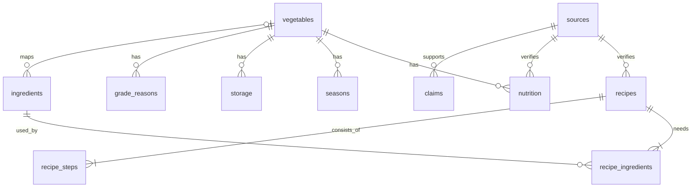

# 공식 채소·레시피 데이터 카탈로그

작성: A 조영우 / 확인일: 2026-10-08. 운영 스택은 Next.js·Supabase PostgreSQL을 유지한다. FastAPI나 별도 백엔드 서버를 추가하지 않는다.

## 구축 결과와 범위

| 항목 | 수량 | 의미 |
|---|---:|---|
| 채소 | 6 | 감자·당근·양파·애호박·가지·파프리카 |
| 공식 레시피 | 16 | 출처 제목·재료·조리법 확인, 누락 정보는 별도 표시 |
| 일반 식재료 | 96 | 고기·곡물·양념 포함. 채소와 선택적으로 연결 |
| 레시피–재료 관계 | 213 | 수량·단위·형태·표시 순서 보존 |
| 독립 요약 조리 단계 | 72 | 원문 전체 복제 없이 작성 |
| 영양 프로필 | 9 | 생것 가식부 100g. 파프리카 국내산 4색 별도 |
| 공식 출처 | 23 | 기관·제목·실제 URL·조회일·검증 범위·해시 |
| 이미지 후보 메타데이터 | 18 | 현재 사용 가능 0건. 권리·실물 미확인 후보는 모두 제외 |
| 검증·편집 근거 | 46 | 공식 사실과 프로젝트 판단을 구분 |
| 미확인 항목 | 77 | `gaps.json`에 항목별 기록. 완료 항목으로 표시하지 않음 |

이는 출처를 검토하고 재현 가능한 데이터 파일을 만드는 작업이다. 상품 판매 DB 구축, 레시피 UI 연결, Supabase 실제 배포, 사진 사용 허가와 최신 영양표 대조까지 완료한 상태는 아니다.

## DB 선택과 파일

현재 Git 기준 코드에는 실행용 DB 환경이나 패키지가 없다. 다른 작업자가 로컬에서 만들고 있는 Supabase 마이그레이션은 수정하지 않았다. 검토용 관계형 카탈로그는 Python 표준 라이브러리 SQLite로 생성하여 누구나 계정 없이 열어볼 수 있게 했다. 운영 앱이 SQLite에 의존하는 설계가 아니다.

| 경로 | 용도 |
|---|---|
| `data/food-catalog/*.json` | 검토·수정 기준 데이터. 원문 전체는 저장하지 않음 |
| `data/food-catalog/schema.sql` | SQLite 초기 스키마 |
| `data/food-catalog/seed.sql` | 스키마와 초기 데이터를 포함한 SQL 덤프 |
| `data/food-catalog/catalog.sqlite` | Git으로 공유하는 읽기용 초기 DB 스냅샷 |
| `data/food-catalog/postgres.sql` | 별도 `food_catalog` 스키마용 PostgreSQL 초기화 파일 |
| `scripts/food_catalog.py` | 생성·검증·SQL 내보내기. 외부 패키지 불필요 |
| `var/food-catalog/` | 개인 실행 DB. Git 제외 |
| `docs/food-catalog-sources.md` | 출처와 레시피 목록 |

Python 3.10 이상에서 저장소 루트의 터미널로 실행한다. VS Code, DB Browser for SQLite로 확인할 수 있다. 기존 개발 프로그램과 Supabase 운영 구성은 바꾸지 않는다.

```powershell
# 각자의 실행 DB 생성
python scripts/food_catalog.py build
python scripts/food_catalog.py validate

# JSON을 수정한 뒤 공유용 스냅샷과 SQL 재생성
python scripts/food_catalog.py build --output data/food-catalog/catalog.sqlite
python scripts/food_catalog.py validate --output data/food-catalog/catalog.sqlite
python scripts/food_catalog.py export
```

잘못된 데이터는 생성 중 검증에 실패하며 기존 DB를 덮어쓰지 않는다. 명령은 네트워크 요청 없이 실행된다. SQLite 빌드 실패 당시 Windows 파일 잠금 문제는 연결을 명시적으로 닫도록 수정했다.

## 관계와 조회



`ingredients`는 일반 식재료 사전이고 `vegetable_id`가 없는 고기·양념도 포함한다. `recipe_ingredients`는 동일 재료가 밑간과 소스에 각각 쓰이는 경우를 위치별로 보존하므로 `(recipe_id, ingredient_id)`를 유일 키로 삼지 않는다. 감자와 알감자는 같은 채소에 연결하되 원문 이름을 보존한다. 말린 애호박은 `form=dried`로 저장하며 생애호박과 중량을 자동 환산하지 않는다. 청피망은 파프리카로 자동 합치지 않는다.

```sql
-- 애호박 활용 레시피
SELECT DISTINCT r.id, r.title, r.servings, r.cook_time_min
FROM recipes r
JOIN recipe_ingredients ri ON ri.recipe_id = r.id
JOIN ingredients i ON i.id = ri.ingredient_id
WHERE i.vegetable_id = 'aehobak';

-- 파프리카 색상별 영양값과 출처
SELECT n.*, s.url FROM nutrition n
JOIN sources s ON s.id = n.source_id
WHERE n.vegetable_id = 'bell-pepper';

-- 확인이 필요한 수량
SELECT r.title, ri.source_name, ri.quantity_text, ri.quantity_status
FROM recipe_ingredients ri JOIN recipes r ON r.id = ri.recipe_id
WHERE ri.quantity_status IN ('source_unspecified','ambiguous');
```

추후 냉장고 재료 검색에서는 `ingredient_id` 집합을 비교해 보유·부족 재료를 계산할 수 있다. 현재 `role=required`는 편집 기본값이며 실제 필수성의 공식 검증 결과가 아니다. 선택 재료 판정과 재료군별 대체 조건은 후속 검토한다. AI 추천 화면은 구현하지 않았다.

## 수치와 정보의 검증 기준

- `null`은 0·무료·즉시 조리를 뜻하지 않는다. 화면에는 ‘정보 확인 중’으로 표시한다.
- 전체 조리시간은 16개 모두 원문 미기재다. 7분 굽기·3분 찌기는 단계별 시간으로만 저장했다. 전체 준비시간을 추정하거나 양의 임의 값을 넣지 않는다.
- 영양표의 ‘1인분’ 표시로 레시피 총 인분을 추정하지 않는다. 재료표에 분량이 명시된 5개만 `servings`를 채웠다.
- `파프리카조그라탕`은 조리법에 파프리카가 있지만 재료표에서 수량이 누락되어 있다. ‘새싹 가지 샐러드’는 원문 전체 재료량이 미기재다.
- 범위·복합 표현과 오타 가능성은 `quantity_text`에 보존한다. `10~15장`, `3×4cm 2장`, `1/2,t`를 임의로 평균·그램·작은술로 바꾸지 않는다.
- 수량의 `T/Ts`는 큰술, `t/ts`는 작은술, `C`는 컵으로 표시한다. 부피를 g으로 환산하지 않는다. `Ts` 표기는 원문 식품안전나라의 표기이며 애매한 변환은 원문 수량 문자열과 함께 확인한다.
- 영양값은 농촌진흥청 **2006년 제7개정판**의 표를 직접 확인했다. 최신 값으로 홍보하지 않는다. 국내산/색상·생것·100g·식품번호·분석 인용연도를 함께 저장했다.
- 감자 지질의 `∅`는 극미량 표시다. 0으로 저장하지 않았다. 제I편 ‘섬유소’를 총 식이섬유로 오인하지 않아 `dietary_fiber_g`는 모두 비워 두었다.
- 과거 공식 자료에 포함된 질병 예방·치료 주장과 소비 통계는 상품 설명에 전재하지 않았다.
- 농사로의 소개 월을 제철로 사용하지 않는다. 검증한 수확기는 양파 4~6월뿐이다. 다른 채소의 국내 지역별 작형·제철은 확인이 필요하다.
- 파프리카 보관 3~4주는 원문의 8~10℃·습도 조건 설명이다. 보통 냉장고에서의 안전 소비기한으로 보장하지 않는다. 보관 방법을 확인한 나머지 채소도 임의의 일수를 넣지 않았다.
- 외형 등급 12개는 프로젝트 예시다. ‘먹어도 안전’이라는 자동 판정에 사용하지 않는다. 감자의 녹색화·싹은 활용 후보에서 제외한다.
- 닭가슴살 채소조림의 생닭 헹굼 지시는 요약에서 제외했다. 서비스 안내에 사용할 조리 안전 지침은 추가 검토한다.

## 이미지와 저작권

원문 전체 본문·PDF·사진은 저장소에 복제하지 않았다. 출처 식별과 재검증을 위한 URL·본문 해시, 재료 사실 및 독립 요약만 저장한다. 공식 홈페이지라는 사실만으로 사진 재사용 허가를 인정하지 않는다. 이미지 후보 18개는 원문 맥락만 확인했으며 실물과 개별 권리가 미확인이라 모두 사용 제외다.

Unsplash/Pexels 사진 채택 시 개별 사진 페이지·작가·라이선스 URL·조회일과 실물 일치 검토를 추가해야 한다. 애호박 사진에 외국 주키니를 대입하지 않는다. 현재 사용 가능 이미지는 0개다. 앱은 승인된 이미지가 없으면 중립적인 자리표시자를 사용한다.

## Supabase 연결과 협업

`postgres.sql`은 별도 `food_catalog` 스키마를 생성하고 모든 테이블에 RLS를 활성화한다. `anon`·`authenticated`에는 스키마 접근을 허용하지 않는다. 공개 접근 정책과 데이터 노출을 준비하기 전 직접 클라이언트에서 읽히지 않는 의도적 상태다. 실행용 SQL의 구조와 데이터는 생성했으나 실제 PostgreSQL 서버에서 실행 검증하거나 Supabase에 적용하지 않았다.

기존 `public.recipes`·`public.vegetables`를 변경하거나 판매 가격·재고·상품 ID를 생성하지 않는다. 같은 스키마를 다시 만들면 실패하도록 작성해 기존 데이터를 지우거나 중복 추가하지 않는다. 검토 후 개발용 Supabase에서 먼저 실행하고 조회 정책을 설계한다.

1. **A 조영우:** 원문 누락값을 허용하는 레시피 조회 타입·Zod 검증·정보 확인 중 UI를 준비한다. 현재 기존 설계의 필수 `cook_time_min`·`difficulty`에 임의 값을 넣으면 안 된다. 인분·이미지도 nullable을 허용한다.
2. **B 심우섭:** 카탈로그 채소 문자열 ID와 상품용 채소 ID 매핑을 명시적으로 관리한다. 파프리카 색상/국내산 조건 및 말린 애호박 형태를 보존한다. 수확기·손질·보관 보완 항목을 검토한다.
3. **C 이상재 및 공통:** 별도 스키마 접근 권한·서버 조회 경로·RLS를 검토하고 읽기 정책과 보안 테스트를 추가한다. 인증·장바구니 테이블과 섞지 않는다.
4. 승인 사진과 최신 영양자료를 확보한 뒤 카탈로그에서 앱용 응답으로 필요한 필드만 선택해 내보낸다. 원문 후보 이미지와 미확인 값은 노출하지 않는다.

## 검증과 남은 작업

SQLite 생성·외래 키·무결성, 조리 단계와 재료 순서, 레시피별 재료/단계 존재, 채소 6종의 레시피 연결과 영양 프로필 존재를 검증한다. 없는 식재료 참조·음수 영양값·권리 미확인 이미지의 사용 가능 전환·수량 미기재 항목의 임의 수치 입력을 DB 제약이 거부하는지도 검사한다. SQL 덤프로 복원한 DB와 JSON 재생성 DB를 비교한다.

남은 작업은 요청 메뉴 감자조림 공공기관 원문, 최신 영양표와 식이섬유, 채소별 지역·작형 수확기, 당근 보관·손질 및 파프리카 손질, 사진 권리·실물 검토, 실제 Supabase 실행 및 앱 통합이다. `gaps.json`은 이 상태를 숨기지 않고 팀이 이어서 관리하기 위한 목록이다.

Redmine 작업: [#197 공식 채소·레시피 카탈로그 구축 및 미확인 자료 보완](https://redmine-302549221655.asia-northeast3.run.app/issues/197), 상위 WBS #189, 담당 A 조영우.

자동 회귀 검증: `python -m unittest discover -s tests -p test_food_catalog.py` — SQL 복원 일치와 반복 생성 2개 테스트 통과. 실제 PostgreSQL 실행과 프론트엔드 빌드는 아직 검증하지 않았으며, 이 브랜치에는 앱 패키지가 없습니다.
